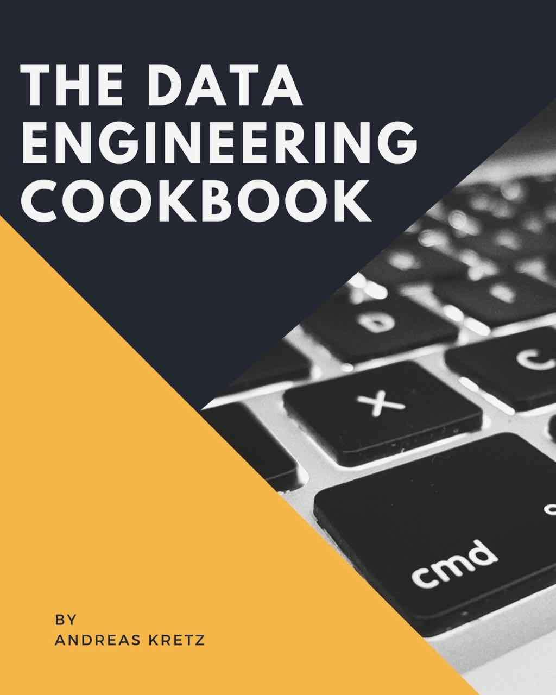

<!--- # The Data Engineering Cookbook -->

	
	 
	 
	 

	<a href="sections/01-Introduction.md">What is this Book?</a>&nbsp;&nbsp;&nbsp;
  <a href="#how-to-contribute">How to Contribute</a>&nbsp;&nbsp;&nbsp;
  <a href="https://www.youtube.com/channel/UCY8mzqqGwl5_bTpBY9qLMAA">YouTube</a>&nbsp;&nbsp;&nbsp;
	<a
  <a href="https://twitter.com/andreaskayy">Twitter</a>&nbsp;&nbsp;&nbsp;
  <a href="https://www.amazon.com/shop/plumbersofdatascience">Amazon Shop</a>

 

### This Book Is & Will Always Be Free!  But Please Support What You Like!
- **Amazon:** [Click Here](https://www.amazon.com/shop/plumbersofdatascience) And buy whatever you like from Amazon* (Also check out my complete podcast gear and books)
- **Patreon:** [Click Here](https://www.patreon.com/plumbersofds) Become a supporter on Patreon
- **PayPal.me:** [Click Here](https://paypal.me/feedthestream) Send some support (Please include a message and I read and answer it in the next video)

### I'm Doing Data Engineer Coaching To Help You On Your Journey:
Do you need help becoming a Data Engineer and doing a personal project?
I offer Data Engineer Coaching to help you on your journey.
Go to my website **[teamdatascience.com](https://teamdatascience.com)** to learn more.

<!---
I get asked super often how to become a Data Engineer.
That's why I decided to start this cookbook with all the topics you need to look into.

It's not only useful for beginners, professionals will definitely like the case study section.

If you look for the old PDF version it's [here](https://github.com/andkret/Cookbook/raw/LaTex-Version-Deprecated/Data%20Engineering%20Cookbook.pdf)

-->

# #Quick Contents:
- [Introduction](#Introduction)
- [Basic Engineering Skills](#Basic-Engineering-Skills)
- [Advanced Engineering Skills](#Advanced-Engineering-Skills)
- [Hands On Course](#Hands-On-Course)‚
- [Case Studies](#Case-Studies)
- [Best Practices Cloud Platforms](#Best-Practices-Cloud-Platforms)
- [130+ Data Sources Data Science](#130+-Data-Sources-Data-Science)
- [1001 Interview Questions](#1001-Interview-Questions)
- [Recommended Books and Courses](#Recommended-Books-and-Courses)
<!--  -->

- [How To Contribute](#how-to-contribute)
- [Support What You Like](#support)
- [Important Links](#important-links)

# Full Table Of Contents:
##  Introduction
- [What is this Cookbook](#what-is-this-cookbook)
- [Data Engineer vs Data Scientist](#data-engineer-vs-data-scientist)
  - [Data Engineer](#data-engineer)
  - [Data Scientist](#data-scientist)
  - [Machine Learning Workflow](#machine-learning-workflow)
  - [Machine Learning Model and Data](#machine-learning-model-and-data)
- [My Data Science Platform Blueprint](#my-data-science-platform-blueprint)
  - [Connect](#connect)
  - [Buffer](#buffer)
  - [Processing Framework](#processing-framework)
  - [Store](#store)
  - [Visualize](#visualize)
- [Who Companies Need](#who-companies-need)

## Basic Engineering Skills
- [Learn To Code](#learn-to-code)
- [Get Familiar With Git](#get-familiar-with-git)
- [Agile Development](#agile-development)
  - [Why is agile so important?](#Why-is-agile-so-important)
  - [Agile rules I learned over the years](#agile-rules-i-learned-over-the-years)
  - [Agile Frameworks](#agile-frameworks)
    - [Scrum](#scrum)
    - [OKR](#okr)
- [Software Engineering Culture](#software-engineering-culture)
- [Learn how a Computer Works](#learn-how-a-computer-works)
- [Data Network Transmission](#data-network-transmission)
- [Security and Privacy](#security-and-privacy)
  - [SSL Public and Private Key Certificates](#ssl-public-and-private-key-Certificates)
  - [JSON Web Tokens](#json-web-tokens)
  - [GDPR regulations](#gdpr-regulations)
- [Linux](#linux)
  - [OS Basics](#os-basics)
  - [Shell scripting](#shell-scripting)
  - [Cron Jobs](#cron-jobs)
  - [Packet Management](#packet-management)
- [Docker](#docker)
  - [What is Docker and How it Works](#what-is-docker-and-what-do-you-use-it-for)
    -  [Don't Mess Up Your System](#dont-mess-up-your-system)
    - [Preconfigured Images](#preconfigured-images)
    - [Take it With You](#take-it-with-you)
    - [Kubernetes Container Deployment](#kubernetes-container-deployment)
    - [How to Create Start and Stop a Container](#how-to-create-start-stop-a-container)
    - [Docker Micro Services](#docker-micro-services)
    - [Kubernetes](#kubernetes)
    - [Why and How To Do Docker Container Orchestration](#why-and-how-to-do-docker-container-orchestration)
    - [Useful Docker Commands](#useful-docker-commands)
- [The Cloud](#the-cloud)
  - [IaaS vs PaaS vs SaaS](#iaas-vs-paas-vs-saas)
  - [AWS Azure IBM Google IBM](#aws-azure-ibm-google)
  - [Cloud vs On-Premises](#cloud-vs-on-premises)
  - [Security](#security)
  - [Hybrid Clouds](#hybrid-clouds)
- [Security Zone Design](#security-zone-design)
  - [How to secure a multi layered application](#how-to-secure-a-multi-layered-application)
  - [Cluster security with Kerberos](#cluster-security-with-kerberos)

## Advanced Engineering Skills
- [Data Science Platform](#data-science-platform)
  - [Why a Good Data Platform Is Important](#why-a-good-data-platform-is-important)
  - [Big Data vs Data Science and Analytics](#Big-Data-vs-Data-Science-and-Analytics)
  - [The 4 Vs of Big Data](#the-4-vs-of-big-data)
  - [Why Big Data](#why-big-data)
    - [Planning is Everything](#planning-is-everything)
    - [The Problem with ETL](#the-problem-with-etl)
    - [Scaling Up](#scaling-up)
    - [Scaling Out](#scaling-out)
    - [When not to Do Big Data](#please-dont-go-big-data)
- [Hadoop Platforms](#hadoop-platforms)
  - [What is Hadoop](#what-is-hadoop)
  - [What makes Hadoop so popular](#what-makes-hadoop-so-popular)
  - [Hadoop Ecosystem Components](#hadoop-ecosystem-components)
  - [Hadoop is Everywhere?](#hadoop-is-everywhere)
  - [Should You Learn Hadoop?](#should-you-learn-hadoop)
  - [How to Select Hadoop Cluster Hardware](#how-to-select-hadoop-cluster-hardware)
- [Connect](#connect)
  - [REST APIs](#rest-apis)
    - [API Design](#api-design)
    - [Implementation Frameworks](#implementation-frameworks)
    - [Security](#security)
  - [Apache Nifi](#apache-nifi)
  - [Logstash](#logstash)
- [Buffer](#buffer)
  - [Apache Kafka](#apache-kafka)
    - [Why a Message Queue Tool?](#why-a-message-queue-tool)
    - [Kafka Architecture](#kafka-architecture)
    - [Kafka Topics](#what-are-topics)
    - [Kafka and Zookeeper](#what-does-zookeeper-have-to-do-with-kafka)
    - [How to Produce and Consume Messages](#how-to-produce-and-consume-messages)
    - [Kafka Commands](#kafka-commands)
  - [Apache Redis Pub-Sub](#redis-pub-sub)
  - [AWS Kinesis](#apache-kafka)
  - [Google Cloud PubSub](#google-cloud-pubsub)
- [Processing Frameworks](#processing-frameworks)
  - [Lambda and Kappa Architecture](#lambda-and-kappa-architecture)
  - [Batch Processing](#batch-processing)
  - [Stream Processing](#stream-processing)
    - [Three Methods of Streaming](#three-methods-of-streaming)
    - [At Least Once](#at-least-once)
    - [At Most Once](#at-most-once)
    - [Exactly Once](#exactly-once)
    - [Check The Tools](#check-the-tools)
  - [Should You do Stream or Batch Processing](#should-you-do-stream-or-batch-processing)
  - [Is ETL still relevant for Analytics?](#is-etl-still-relevant-for-analytics)
  - [MapReduce](#mapreduce)
    - [How Does MapReduce Work](#How-does-mapreduce-work)
    - [MapReduce](#mapreduce)
    - [MapReduce Example](#example)
    - [MapReduce Limitations](#What-is-the-limitation-of-mapreduce)
  - [Apache Spark](#apache-spark)
    - [What is the Difference to MapReduce?](#what-is-the-difference-to-MapReduce)
    - [How Spark Fits to Hadoop](#how-does-spark-fit-to-hadoop)
    - [Spark vs Hadoop](#wheres-the-difference)
    - [Spark and Hadoop a Perfect Fit](#spark-and-hadoop-is-a-perfect-fit)
    - [Spark on YARn](#spark-on-yarn)
    - [My Simple Rule of Thumb](#my-simple-rule-of-thumb)
    - [Available Languages](#available-languages)
    - [Spark Driver Executor and SparkContext](#how-spark-works-driver-executor-sparkcontext)
    - [Spark Batch vs Stream processing](#spark-batch-vs-stream-processing)
    - [How Spark uses Data From Hadoop](#How-does-spark-use-data-from-hadoop)
    - [What are RDDs and How to Use Them](#what-are-rdds-and-how-to-use-them)
    - [SparkSQL How and Why to Use It](#available-languages)
    - [What are Dataframes and How to Use Them](#what-are-dataframes-how-to-use-them)
    - [Machine Learning on Spark (TensorFlow)](#machine-learning-on-spark-tensor-flow)
    - [MLlib](#mllib)
    - [Spark Setup](#spark-setup)
    - [Spark Resource Management](#spark-resource-management)
  - [AWS Lambda](#apache-flink)  
  - [Apache Flink](#apache-flink)
  - [Elasticsearch](#elasticsearch)
  - [Apache Drill](#apache-drill)
  - [StreamSets](#streamsets)
- [Store](#store)
  - [Data Warehouse vs Data Lake](#data-warehouse-vs-data-lake)
  - [SQL Databases](#sql-databases)
    - [PostgreSQL DB](#postgresql-db)
    - [Database Design](#database-design)
    - [SQL Queries](#sql-queries)
    - [Stored Procedures](#stored-procedures)
    - [ODBC/JDBC Server Connections](#odbc-jdbc-server-connections)
  - [NoSQL Stores](#nosql-stores)
    - [HBase KeyValue Store](#keyvalue-stores-hbase)
    - [HDFS Document Store](#document-stores-hdfs)
    - [MongoDB Document Store](#document-stores-mongodb)
    - [Elasticsearch Document Store](#Elasticsearch-search-engine-and-document-store)
    - [Graph Databases (Neo4j)](#graph-db-neo4j)
    - [Impala](#impala)
    - [Kudu](#kudu)
    - [Apache Druid](#apache-druid)
    - [InfluxDB Time Series Database](#influxdb-time-series-database)
    - [Greenplum MPP Database](#mpp-databases-greenplum)
  - [NoSQL Data Warehouses](#nosql-data-warehouses)
    - [Hive Warehouse](#hive-warehouse)
    - [Impala](#impala)
- [Visualize](#visualize)
  - [Android and IOS](#android-and-ios)
  - [API Design for Mobile Apps](#how-to-design-apis-for-mobile-apps)
  - [Dashboards](#dashboards)
    - [Grafana](#grafana)
    - [Kibana](#kibana)
  - [Webservers](#how-to-use-webservers-to-display-content)
    - [Tomcat](#tomcat)
    - [Jetty](#jetty)
    - [NodeRED](#nodered)
    - [React](#react)
  - [Business Intelligence Tools](#business-intelligence-tools)
    - [Tableau](#tableau)
    - [Power BI](#power-bi)
    - [Quliksense](#quliksense)
  - [Identity & Device Management](#Identity-and-device-management)
    - [What Is A Digital Twin](#what-is-a-digital-twin)
    - [Active Directory](#active-directory)
- [Machine Learning](#machine-learning)
  - [How to do Machine Learning in production](#how-to-domachine-learning-in-production)
  - [Why machine learning in production is harder then you think](#why-machine-learning-in-production-is-harder-then-you-think)
  - [Models Do Not Work Forever](#models-do-not-work-forever)
  - [Where are The Platforms That Support Machine Learning](#where-are-the-platforms-that-support-this)
  - [Training Parameter Management](#training-parameter-management)
  - [How to Convince People That Machine Learning Works](#how-to-convince-people-machine-learning-works)
  - [No Rules No Physical Models](#no-rules-no-physical-models)
  - [You Have The Data. Use It!](#you-have-the-data-use-it)
  - [Data is Stronger Than Opinions](#data-is-stronger-than-opinions)
  - [AWS Sagemaker](#aws-sagemaker)

## Hands On Course

- [What We Want To Do](#what-we-want-to-do)
- [Thoughts On Choosing A Development Environment](#thoughts-on-choosing-a-development-environment)
- [A Look Into the Twitter API](#a-look-into-the-twiiter-api)
- [Ingesting Tweets with Apache Nifi](#ingesting-tweets-with-apache-nifi)
- [Writing from Nifi to Apache Kafka](#writing-from-nifi-to-kafka)
- [Apache Zeppelin Data Processing](#apache-zeppelin)
  - [Install and Ingest Kafka Topic](#install-and-ingest-kafka-topic)
  - [Processing Messages with Spark & SparkSQL](#processing-messages-with-spark-and-sparksql)
  - [Visualizing Data](#visualizing-data)
- [Switch Processing from Zeppelin to Spark](#switch-processing-from-zeppelin-to-spark)

## Case Studies

- [Data Science @Airbnb](#data-science-at-Airbnb)
- [Data Science @Amazon](#data-science-at-Amazon)
- [Data Science @Baidu](#data-science-at-Baidu)
- [Data Science @Blackrock](#data-science-at-Blackrock)
- [Data Science @BMW](#data-science-at-BMW)
- [Data Science @Booking.com](#data-science-at-Booking.com)
- [Data Science @CERN](#data-science-at-CERN)
- [Data Science @Disney](#data-science-at-Disney)
- [Data Science @DLR](#data-science-at-DLR)
- [Data Science @Drivetribe](#data-science-at-Drivetribe)
- [Data Science @Dropbox](#data-science-at-Dropbox)
- [Data Science @Ebay](#data-science-at-Ebay)
- [Data Science @Expedia](#data-science-at-Expedia)
- [Data Science @Facebook](#data-science-at-Facebook)
- [Data Science @Google](#data-science-at-Google)
- [Data Science @Grammarly](#data-science-at-Grammarly)
- [Data Science @ING Fraud](#data-science-at-ING-Fraud)
- [Data Science @Instagram](#data-science-at-Instagram)
- [Data Science @LinkedIn](#data-science-at-LinkedIn)
- [Data Science @Lyft](#data-science-at-Lyft)
- [Data Science @NASA](#data-science-at-NASA)
- [Data Science @Netflix](#data-science-at-Netflix)
- [Data Science @OLX](#data-science-at-OLX)
- [Data Science @OTTO](#data-science-at-OTTO)
- [Data Science @Paypal](#data-science-at-Paypal)
- [Data Science @Pinterest](#data-science-at-Pinterest)
- [Data Science @Salesforce](#data-science-at-Salesforce)
- [Data Science @Siemens Mindsphere](#data-science-at-Siemens-Mindsphere)
- [Data Science @Slack](#data-science-at-Slack)
- [Data Science @Spotify](#data-science-at-Spotify)
- [Data Science @Symantec](#data-science-at-Symantec)
- [Data Science @Tinder](#data-science-at-Tinder)
- [Data Science @Twitter](#data-science-at-Twitter)
- [Data Science @Uber](#data-science-at-Uber)
- [Data Science @Upwork](#data-science-at-Upwork)
- [Data Science @Woot](#data-science-at-Woot)
- [Data Science @Zalando](#data-science-at-Zalando)

## Best Practices Cloud Platforms

- [Amazon Web Services (AWS)](#aws)
  - [Connect](#Connect)
  - [Buffer](#Buffer)
  - [Processing](#Processing)
  - [Store](#Store)
  - [Visualize](#Visualize)
  - [Containerization](#Containerization)
  - [Best Practices](#Best-Practices)
  - [More Details](#More-Details)
- [Microsoft Azure](#azure)
  - [Connect](#Connect-1)
  - [Buffer](#Buffer-1)
  - [Processing](#Processing-1)
  - [Store](#Store-1)
  - [Visualize](#Visualize-1)
  - [Containerization](#Containerization-1)
  - [Best Practices](#Best-Practices-1)
- [Google Cloud Platform (GCP)](#gcp)
  - [Connect](#Connect-2)
  - [Buffer](#Buffer-2)
  - [Processing](#Processing-2)
  - [Store](#Store-2)
  - [Visualize](#Visualize-2)
  - [Containerization](#Containerization-2)
  - [Best Practices](#Best-Practices-2)

## 130+ Free Data Sources For Data Science

- [General And Academic](#General-And-Academic)
- [Content Marketing](#Content-Marketing)
- [Crime](#Crime)
- [Drugs](#Drugs)
- [Education](#Education)
- [Entertainment](#Entertainment)
- [Environmental And Weather Data](#Environmental-And-Weather-Data)
- [Financial And Economic Data](#Financial-And-Economic-Data])
- [Government And World](#Government-And-World)
- [Health](#Health)
- [Human Rights](#Human-Rights)
- [Labor And Employment Data](#Labor-And-Employment-Data)
- [Politics](#Politics)
- [Retail](#Retail)
- [Social](#Social)
- [Travel And Transportation](#Travel-And-Transportation)
- [Various Portals](#Various-Portals)
- [Source Articles and Blog Posts](#Source-Articles-and-Blog-Posts)
- [Free Data Sources Data Science](sections/07-DataSources.md)

## 1001 Interview Questions

- [Interview Questions](#1001-Data-Engineering-Interview-Questions)

## Recommended Books and Courses

- [About Books and Courses](#about-books-and-courses)
- [Books](#books)
  - [Languages](#books-languages)
    - [Java](#java)
    - [Python](#Python)
    - [Scala](#Scala)
    - [Swift](#Swift)
  - [Data Science Tools](#data-science-tools)
    - [Apache Spark](#apache-spark)
    - [Apache Kafka](#apache-Kafka)
    - [Apache Hadoop](#apache-Hadoop)
    - [Apache HBase](#apache-HBase)
  - [Business](#Business)
    - [The Lean Startup](#the-lean-startup)
    - [Zero to One](#zero-to-one)
    - [The Innovators Dilemma](#the-innovators-dilemma)
    - [Crossing the Chasm](#crossing-the-chasm)
    - [Crush It!](#crush-it!)
  - [Community Recommendations](#Community-Recommendations)
    - [Designing Data-Intensive Applications](#designing-data-intensive-applications)
- [Online Courses](#online-courses)
  - [Machine Learning Stanford](#machine-learning-stanford)
  - [Computer Networking](#computer-networking)
  - [Spring Framework](#spring-framework)
  - [IOS App Development Specialization](#ios-app-development-specialization)

## How To Contribute
If you have some cool links or topics for the cookbook, please become a contributor.

Simply pull the repo, add your ideas and create a pull request.
You can also open an issue and put your thoughts there.

Please use the "Issues" function for comments.

## Support

Everything is free, but please support what you like!
Join my Patreon and become a plumber yourself:
[Link to my Patreon](https://patreon.com/plumbersofds)

Or support me and send a message I read on the next livestream through Paypal.me:
[Link to my Paypal.me/feedthestream](https://paypal.me/feedthestream)

## Important Links

Subscribe to my Plumbers of Data Science YouTube channel for regular updates:
[Link to YouTube](https://www.youtube.com/channel/UCY8mzqqGwl5_bTpBY9qLMAA)

Check out my blog and get updated via mail by joining my mailing list:
[andreaskretz.com](https://andreaskretz.com)

I have a Medium publication where you can publish your data engineer articles to reach more people:
[Medium publication](https://link.medium.com/9oi1VDrhPW)

 
*(As an Amazon Associate I earn from qualifying purchases from Amazon
This is free of charge for you, but super helpful for supporting this channel)*

Introduction
============

## What is this Cookbook

I get asked a lot:
"What do you actually need to learn to become an awesome data engineer?"

Well, look no further. you'll find it here!

If you are looking for AI algorithms and such data scientist things,
this book is not for you.

**How to use this Cookbook:**
This book is intended to be a starting point for you. It is not a training! I want to help you to identify the topics to look into and becoming an awesome data engineer in the process.

It hinges on my Data Science Platform Blueprint, check it out below. Once you understand it, you can find in the book tools that fit into each key area of a Data Science platform (Connect, Buffer, Processing Framework, Store, Visualize).

Select a few tools you are interested in, research and work with them.

Don't learn everything in this book! Focus.

**What types of content are in this book?**
You are going to find five types of content in this book: Articles
I wrote, links to my podcast episodes (video & audio), more than 200
links to helpful websites I like, data engineering interview questions
and case studies.

**This book is a work in progress!**
As you can see, this book is not finished. I'm constantly adding new
stuff and doing videos for the topics. But obviously, because I do this
as a hobby my time is limited. You can help making this book even
better.

**Help make this book awesome!**
If you have some cool links or topics for the cookbook, please become a
contributor on GitHub: <https://github.com/andkret/Cookbook>. Fork the
repo, add them and create a pull request. Or join the discussion by
opening Issues. Tell me your thoughts, what you value,
what you think should be included, or correct me where I am wrong.
You can also write me an email any time to
plumbersofdatascience\@gmail.com anytime.

**This Cookbook is and will always be free!**
I don't want to sell you this book, but please support what you like and
join my Patreon: <https://www.patreon.com/plumbersofds>.
Or send me a message and support through PayPal: <https://paypal.me/feedthestream>

Check out this podcast episode where I talk in detail why I decided to
share all this information for free: [\#079 Trying to stay true to
myself and making the cookbook public on
GitHub](https://youtu.be/k1bS5aSPos8)

Data Engineer vs Data Scientist
-------------------------------

| Podcast Episode: #050 Data Engineer, Scientist or Analyst - Which One Is For You?
|-----------------------------------------------------------------------------------
| In this podcast we talk about the differences between data scientists, analysts and engineers. Which are the three main data science jobs. All three are super important. This makes it easy to decide
| [Watch on YouTube](https://youtu.be/64TYZETOEdQ) \ [Listen on Anchor](https://anchor.fm/andreaskayy/episodes/050-Data-Engineer-Scientist-or-Analyst-Which-One-Is-For-You-e45ibl)

### Data Engineer

Data Engineers are the link between the management's data strategy
and the data scientists that need to work with data.

What they do is building the platforms that enable data scientists to do
their magic.

These platforms are usually used in five different ways:

-   Data ingestion and storage of large amounts of data

-   Algorithm creation by data scientists

-   Automation of the data scientist's machine learning models and
    algorithms for production use

-   Data visualization for employees and customers

-   Most of the time these guys start as traditional solution architects
    for systems that involve SQL databases, web servers, SAP
    installations and other "standard" systems.

But to create big data platforms the engineer needs to be an expert in
specifying, setting up and maintaining big data technologies like:
Hadoop, Spark, HBase, Cassandra, MongoDB, Kafka, Redis and more.

What they also need is experience on how to deploy systems on cloud
infrastructure like at Amazon or Google or on-premise hardware.

| Podcast Episode: #048 From Wannabe Data Scientist To Engineer My Journey
|------------------|
|In this episode Kate Strachnyi interviews me for her humans of data science podcast. We talk about how I found out that I am more into the engineering part of data science.  
| [Watch on YouTube](https://youtu.be/pIZkTuN5AMM) \ [Listen on Anchor](https://anchor.fm/andreaskayy/episodes/048-From-Wannabe-Data-Scientist-To-Engineer-My-Journey-e45i2o)|

### Data Scientist

Data scientists aren't like every other scientist.

Data scientists do not wear white coats or work in high tech labs full
of science fiction movie equipment. They work in offices just like you
and me.

What differs them from most of us is that they are math experts. They
use linear algebra and multivariable calculus to create new insight from
existing data.

How exactly does this insight look?

Here's an example:

An industrial company produces a lot of products that need to be tested
before shipping.

Usually such tests take a lot of time because there are hundreds of
things to be tested. All to make sure that your product is not broken.

Wouldn't it be great to know early if a test fails ten steps down the
line? If you knew that you could skip the other tests and just trash the
product or repair it.

That's exactly where a data scientist can help you, big-time. This field
is called predictive analytics and the technique of choice is machine
learning.

Machine what? Learning?

Yes, machine learning, it works like this:

You feed an algorithm with measurement data. It generates a model and
optimises it based on the data you fed it with. That model basically
represents a pattern of how your data is looking. You show that model
new data and the model will tell you if the data still represents the
data you have trained it with. This technique can also be used for
predicting machine failure in advance with machine learning. Of course
the whole process is not that simple.

The actual process of training and applying a model is not that hard. A
lot of work for the data scientist is to figure out how to pre-process
the data that gets fed to the algorithms.

In order to train an algorithm you need useful data. If you use any data
for the training the produced model will be very unreliable.

A unreliable model for predicting machine failure would tell you that
your machine is damaged even if it is not. Or even worse: It would tell
you the machine is ok even when there is an malfunction.

Model outputs are very abstract. You also need to post-process the model
outputs to receive the outputs you desire

### Machine Learning Workflow

Data Scientists and Data Engineers. How does that all fit together?

You have to look at the data science process. How stuff is created and how data
science is done. How machine learning is
done.

The machine learning process shows, that you start with a training phase. A phase where you are basically training the algorithms to create the right output.

In the learning phase you are having the input parameters. Basically the configuration of the model and you have the input data.

What you're doing is you are training the algorithm. While training the algorithm modifies the training
parameters. It also modifies the used data and then you are getting to an output.

Once you get an output you are evaluating. Is that output okay, or is that output not the desired output?

if the output is not what you were looking for? Then you are continuing with the training phase.

You're trying to retrain the model hundreds, thousands, hundred thousands of times. Of course all this is being done automatically.

Once you are satisfied with the output, you are putting the model into production. In production it is no longer fed with training
data it's fed with the live data.

It's evaluating the input data live and putting out live results.

So, you went from training to production and then what?

What you do is monitoring the output. If the output keeps making sense, all good!

If the output of the model changes and it's on longer what you have expected, it means the model doesn't work anymore.

You need to trigger a retraining of the model. It basically gets to getting trained again.

Once you are again satisfied with the output, you put it into production again. It replaces the one in production.

This is the overall process how machine learning. It's how the learning part of data science is working.

### Machine Learning Model and Data

Now that's all very nice.

When you look at it, you have two very important places where you have data.

You have in the training phase two types of data:
Data that you use for the training. Data that basically configures the model, the hyper parameter configuration.

Once you're in production you have the live data that is streaming in. Data that is coming in from from an app, from
a IoT device, logs, or whatever.

A data catalog is also important. It explains which features are available and how different data sets are labeled.

All different types of data. Now, here comes the engineering part.

The Data Engineers part, is making this data available. Available to the data scientist and the machine learning process.

So when you look at the model, on the left side you have your hyper parameter configuration. You need to store and manage these configurations somehow.

Then you have the actual training data.

There's a lot going on with the training data:

Where does it come from? Who owns it? Which is basically data governance.

What's the lineage? Have you modified this data? What did you do, what was the basis, the raw data?

You need to access all this data somehow. In training and in production.

In production you need to have access to the live data.

All this is the data engineers job. Making the data available.

First an architect needs to build the platform. This can also be a good data engineer.

Then the data engineer needs to build the pipelines. How is the data coming in and how is the platform
connecting to other systems.

How is that data then put into the storage. Is there a pre processing for the algorithms necessary? He'll do it.

Once the data and the systems are available, it's time for the machine learning part.

It is ready for processing. Basically ready for the data scientist.

Once the analytics is done the data engineer needs to build pipelines to make it then accessible again. For instance for other analytics processes, for APIs, for front ends and so on.

All in all, the data engineer's part is a computer science part.

That's why I love it so much :)

## My Data Science Platform Blueprint

I have created a simple and modular big data platform
blueprint. It is based on what I have seen in the field and
read in tech blogs all over the internet.

Why do I believe it will be super useful to you?

Because, unlike other blueprints it is not focused on technology.

Following my blueprint will allow you to create the big data platform
that fits exactly your needs. Building the perfect platform will allow
data scientists to discover new insights.

It will enable you to perfectly handle big data and allow you to make
data driven decisions.

The blueprint is focused on the five key areas: Connect, Buffer, Processing Frameworks, Store and Visualize.

Having the platform split like this turns it into a modular platform with
loosely coupled interfaces.

Why is it so important to have a modular platform?

If you have a platform that is not modular you end up with something
that is fixed or hard to modify. This means you can not adjust the
platform to changing requirements of the company.

Because of modularity it is possible to specifically select tools for your use case. It also allows you to replace every component, if you need it.

Now, lets talk more about each key area.

### Connect

Ingestion is all about getting the data in from the source and making it
available to later stages. Sources can be everything from tweets, server
logs to IoT sensor data (e.g. from cars).

Sources send data to your API Services. The API is going to push the
data into a temporary storage.

The temporary storage allows other stages simple and fast access to
incoming data.

A great solution is to use messaging queue systems like Apache Kafka,
RabbitMQ or AWS Kinesis. Sometimes people also use caches for
specialised applications like Redis.

A good practice is that the temporary storage follows the
publish-subscribe pattern. This way APIs can publish messages and
Analytics can quickly consume them.

### Buffer

In the buffer phase you have pub/sub systems like Apache Kafka, Redis, or other Cloud tools like Google pub/sub or AWS Kinesis.

These systems are more or less message Queues.
You put something in on one side and take it out on the other.

The idea behind buffers is to have an intermediate system for the incoming data.

How this works is, for instance you're getting data in from from an API.
The API is publishing into the message queue. Data is buffered there until it is picked up by the processing.

If you don't have a buffer you can run into problems when writing directly into a store, or you're processing the data directly. You can always have peaks of incoming data that stall the systems.

Like, it's lunch break and people are working with your app way more then usually.
There's more data coming in very very fast. Faster than the analytics of the storage can handle.

In this case you would run into problems, because the whole system would stall. It would therefore take long to process the data and your customers would be annoyed.

With a buffer you're buffering the incoming data. Processes for storage and analytics can take out only as much data as they can process. You are no longer in danger of overpowering systems.

Buffers are also really good for building pipelines.

You take data out of Kafka, you pre-process it and put it back into Kafka.
Then with another analytics process you take the processed data back out and put it into a store.

Ta Da! A pipeline.

### Processing Framework

The analyse stage is where the actual analytics is done. Analytics, in
the form of stream and batch processing.

Streaming data is taken from ingest and fed into analytics. Streaming
analyses the "live" data, thus generating fast results.

As the central and most important stage, analytics also has access to
the big data storage. Because of that connection, analytics can take a
big chunk of data and analyse it.

This type of analysis is called batch processing. It will deliver you
answers for the big questions.

To learn more about stream and batch processing read my blog post:
[missing](missing) How to Create New and Exciting Big Data Aided
Products

The analytics process, batch or streaming, is not a one way process.
Analytics can also write data back to the big data storage.

Often times writing data back to the storage makes sense. It allows you
to combine previous analytics outputs with the raw data.

Analytics give insights when you combine
raw data. This combination will often times allow you to create even more
useful insights.

A wide variety of analytics tools are available. Ranging from MapReduce
or AWS Elastic MapReduce to Apache Spark and AWS lambda.

### Store

This is the typical big data storage where you just store everything. It
enables you to analyse the big picture.

Most of the data might seem useless for now, but it is of upmost
importance to keep it. Throwing data away is a big no no.

Why not throw something away when it is useless?

Although it seems useless for now, data scientists can work with the
data. They might find new ways to analyse the data and generate valuable
insights from it.

What kind of systems can be used to store big data?

Systems like Hadoop HDFS, Hbase, Amazon S3 or DynamoDB are a perfect fit
to store big data.

Check out my podcast how to decide between SQL and NoSQL:
<https://anchor.fm/andreaskayy/embed/episodes/NoSQL-Vs-SQL-How-To-Choose-e12f1o>

### Visualize

Displaying data is as important as ingesting, storing and analysing it.
Visualizations enable business users to make data driven decisions.

This is why it is important to have a good visual presentation of the
data. Sometimes you have a lot of different use cases or projects using
the platform.

It might not be possible for you to build the perfect UI that fits
everyone needs. What you should do in this case is enable others to build the
perfect UI themselves.

How to do that? By creating APIs to access the data and making them
available to developers.

Either way, UI or API the trick is to give the display stage direct
access to the data in the big data cluster. This kind of access will
allow the developers to use analytics results as well as raw data to
build the perfect application.

## Who Companies Need

For a company, it is important to have well-trained data
engineers and data scientists. Think of the data scientist as a
professional race car driver. A fit athlete with talent and driving
skills like you have never seen before.

What he needs to win races is someone who will provide him the perfect
race car to drive. It is the data engineer/solution architect who will design and built the race car.

Like the driver and the race car engineer, the data scientist and the data engineer need to work closely together. They need to know the different big data tools inside out.

That's why companies are looking for people with Spark experience. Spark is the common ground between the data engineer and the data scientist that drives innovation.

Spark gives data scientists the tools to do analytics and helps
engineers to bring the data scientist's algorithms into production.
After all, those two decide how good the data platform is, how good the
analytics insight is and how fast the whole system gets into a
production-ready state.

Basic Data Engineering Skills
=============================

Learn To Code
-------------

Why this is important: Without coding you cannot do much in data
engineering. I cannot count the number of times I needed a quick Java
hack.

The possibilities are endless:

-   Writing or quickly getting some data out of a SQL DB

-   Testing to produce messages to a Kafka topic

-   Understanding the source code of a Java Webservice

-   Reading counter statistics out of a HBase key value store

So, which language do I recommend then?

I highly recommend Java. It's everywhere!

When you are getting into data processing with Spark you should use
Scala. But, after learning Java this is easy to do.

Also Python is a great choice. It is super versatile.

Personally however, I am not that big into Python. But I am going to
look into it

Where to Learn? There's a Java Course on Udemy you could look at:
<https://www.udemy.com/java-programming-tutorial-for-beginners>

-   OOP Object oriented programming

-   What are Unit tests to make sure what you code is working

-   Functional Programming

-   How to use build management tools like Maven

-   Resilient testing (?)

I talked about the importance of learning by doing in this podcast:
<https://anchor.fm/andreaskayy/episodes/Learning-By-Doing-Is-The-Best-Thing-Ever---PoDS-035-e25g44>

Get Familiar With Git
---------------------

Why this is important: One of the major problems with coding is to keep
track of changes. It is also almost impossible to maintain a program you
have multiple versions of.

Another problem is the topic of collaboration and documentation, which
is super important.

Let's say you work on a Spark application and your colleagues need to
make changes while you are on holiday. Without some code management they
are in huge trouble:

Where is the code? What have you changed last? Where is the
documentation? How do we mark what we have changed?

But if you put your code on GitHub your colleagues can find your code.
They can understand it through your documentation (please also have
in-line comments)

Developers can pull your code, make a new branch and do the changes.
After your holiday you can inspect what they have done and merge it with
your original code and you end up having only one application.

Where to learn: Check out the GitHub Guides page where you can learn all
the basics: <https://guides.github.com/introduction/flow/>

This great GitHub commands cheat sheet saved my butt multiple times:
<https://www.atlassian.com/git/tutorials/atlassian-git-cheatsheet>

Also look into:

-   Pull

-   Push

-   Branching

-   Forking

GitHub uses markdown to write pages. A super simple language that is actually a lot of fun to write. Here's a markdown cheat cheatsheet:
<https://www.markdownguide.org/cheat-sheet/>

Pandoc is a great tool to convert any text file from and to markdown:
<https://pandoc.org>

Agile Development
-----------------

Agility, the ability to adapt quickly to changing circumstances.

These days everyone wants to be agile. Big or small company people are
looking for the "startup mentality".

Many think it's the corporate culture. Others think it's the process how
we create things that matters.

In this article I am going to talk about agility and self-reliance.
About how you can incorporate agility in your professional career.

### Why is agile so important?

Historically, development is practiced as an explicitly defined process. You
think of something, specify it, have it developed and then built in mass
production.

It's a bit of an arrogant process. You assume that you already know
exactly what a customer wants. Or how a product has to look and how
everything works out.

The problem is that the world does not work this way!

Often times the circumstances change because of internal factors.

Sometimes things just do not work out as planned or stuff is harder than
you think.

You need to adapt.

Other times you find out that you build something customers do not like
and need to be changed.

You need to adapt.

That's why people jump on the Scrum train. Because Scrum is the
definition of agile development, right?

### Agile rules I learned over the years

#### Is the method making a difference?

Yes, Scrum or Google's OKR can help to be more agile. The secret to
being agile however, is not only how you create.

What makes me cringe is people trying to tell you that being agile
starts in your head. So, the problem is you?

No!

The biggest lesson I have learned over the past years is this: Agility
goes down the drain when you outsource work.

#### The problem with outsourcing

I know on paper outsourcing seems like a no-brainer: Development costs
against the fixed costs.

It is expensive to bind existing resources on a task. It is even more
expensive if you need to hire new employees.

The problem with outsourcing is that you pay someone to build stuff for
you.

It does not matter who you pay to do something for you. He needs to make
money.

His agenda will be to spend as little time as possible on your work. That
is why outsourcing requires contracts, detailed specifications,
timetables and delivery dates.

He doesn't want to spend additional time on a project, only because you
want changes in the middle. Every unplanned change costs him time and
therefore money.

If so, you need to make another detailed specification and a contract
change.

He is not going to put his mind into improving the product while
developing. Firstly because he does not have the big picture. Secondly
because he does not want to.

He is doing as he is told.

Who can blame him? If I was the subcontractor I would do exactly the
same!

Does this sound agile to you?

#### Knowledge is king: A lesson from Elon Musk

Doing everything in house, that's why startups are so productive. No
time is wasted on waiting for someone else.

If something does not work, or needs to be changed, there is someone in
the team who can do it right away.

One very prominent example who follows this strategy is Elon Musk.

Tesla's Gigafactories are designed to get raw materials in on one side
and spit out cars on the other. Why do you think Tesla is building
Gigafactories who cost a lot of money?

Why is SpaceX building its one space engines? Clearly there are other,
older, companies who could do that for them.

Why is Elon building tunnel boring machines at his new boring company?

At first glance this makes no sense!

#### How you really can be agile

If you look closer it all comes down to control and knowledge. You, your
team, your company, needs to do as much as possible on your own.
Self-reliance is king.

Build up your knowledge and therefore the teams knowledge. When you have
the ability to do everything yourself, you are in full control.

You can build electric cars, rocket engines or bore tunnels.

Don't largely rely on others and be confident to just do stuff on your
own.

Dream big and JUST DO IT!

PS. Don't get me wrong. You can still outsource work. Just do it in a
smart way by outsourcing small independent parts.

### Agile Frameworks

#### Scrum

There's an interesting Scrum Medium publication with a lot of details
about Scrum: <https://medium.com/serious-scrum>

Also this scrum guide webpage has good infos about Scrum:
<https://www.scrumguides.org/scrum-guide.html>

#### OKR

I personally love OKR, and have been using it for years. Especially for smaller
teams, OKR is great. You don't have a lot of overhead and get work done.
It helps you stay focused and look at the bigger picture.

I recommend to do a sync meeting every Monday. There you talk about what
happened last week and what you are going to work on this week.

I talked about this in this Podcast:
<https://anchor.fm/andreaskayy/embed/episodes/Agile-Development-Is-Important-But-Please-Dont-Do-Scrum--PoDS-041-e2e2j4>

This is also this awesome 1,5 hours startup guide from Google:
<https://youtu.be/mJB83EZtAjc> I really love this video, I rewatched it
multiple times.

### Software Engineering Culture

The software engineering and development culture is super important. How
does a company handle product development with hundreds of developers.
Check out this podcast:

| Podcast Episode: #070 Engineering Culture At Spotify
|------------------
|In this podcast we look at the engineering culture at Spotify, my favorite music streaming service. The process behind the development of Spotify is really awesome.
  |[Watch on YouTube](https://youtu.be/1asVrsUDbp0) \ [Listen on Anchor](https://anchor.fm/andreaskayy/episodes/070-The-Engineering-Culture-At-Spotify-e45ipa)|

**Some interesting slides:**

<https://labs.spotify.com/2014/03/27/spotify-engineering-culture-part-1/>

<https://labs.spotify.com/2014/09/20/spotify-engineering-culture-part-2/>

Learn how a Computer Works
--------------------------

### CPU,RAM,GPU,HDD

### Differences between PCs and Servers

I talked about computer hardware and GPU processing in this podcast:
<https://anchor.fm/andreaskayy/embed/episodes/Why-the-hardware-and-the-GPU-is-super-important--PoDS-030-e23rig>

Data Network Transmission
---------------------------------------

### OSI Model

The OSI Model describes how data is flowing through the network. It
consists of layers starting from physical layers, basically how the data
is transmitted over the line or optic fiber.

Cisco page that shows the layers of the OSI model and how it works:
<https://learningnetwork.cisco.com/docs/DOC-30382>

Check out this page:
<https://www.studytonight.com/computer-networks/complete-osi-model>

The Wikipedia page is also very good:
<https://en.wikipedia.org/wiki/OSI_model>

###### Which protocol lives on which layer?

Check out this network protocol map. Unfortunately it is really hard to
find it theses days:
<https://www.blackmagicboxes.com/wp-content/uploads/2016/12/Network-Protocols-Map-Poster.jpg>

### IP Subnetting

Check out this IP Address and Subnet guide from Cisco:
<https://www.cisco.com/c/en/us/support/docs/ip/routing-information-protocol-rip/13788-3.html>

A calculator for Subnets:
<https://www.calculator.net/ip-subnet-calculator.html>

### Switch, Layer 3 Switch

For an introduction to how Ethernet went from broadcasts, to bridges, to
Ethernet MAC switching, to Ethernet & IP (layer 3) switching, to
software defined networking, and to programmable data plane that can
switch on any packet field and perform complex packet processing, see
this video: <https://youtu.be/E0zt_ZdnTcM?t=144>

### Router

### Firewalls

I talked about Network Infrastructure and Techniques in this podcast:
<https://anchor.fm/andreaskayy/embed/episodes/IT-Networking-Infrastructure-and-Linux-031-PoDS-e242bh>

Security and Privacy
--------------------

### SSL Public and Private Key Certificates

### What is a certificate authority

### JSON Web Tokens

Link to the Wiki page: <https://en.wikipedia.org/wiki/JSON_Web_Token>

### GDPR regulations

The EU created the GDPR \"General Data Protection Regulation\" to
protect your personal data like: Your name, age, where you live and so
on.

It's huge and quite complicated. If you want to do online business in
the EU you need to apply these rules. The GDPR is applicable since May
25th 2018. So, if you haven't looked into it, now is the time.

The penalties can be crazy high if you do mistakes here.

Check out the full GDPR regulation here: <https://gdpr-info.eu>

By the way, if you do profiling or in general analyse big data, look
into it. There are some important regulations. Unfortunately.

I spend months with GDPR compliance. Super fun. Not! Hahaha

### Privacy by design

When should you look into privacy regulations and solutions?

Creating the product or service first and then bolting on the privacy is
a bad choice. The best way is to start implementing privacy right away
in the engineering phase.

This is called privacy by design. Privacy as an integral part of your
business, not just something optional.

Check out the Wikipedia page to get a feeling of the important
principles: <https://en.wikipedia.org/wiki/Privacy_by_design>

Linux
-----

Linux is very important to learn, at least the basics. Most Big Data
tools or NoSQL databases are running on Linux.

From time to time you need to modify stuff through the operation system.
Especially if you run an infrastructure as a service solution like
Cloudera CDH, Hortonworks or a MapR Hadoop distribution.

### OS Basics

Show all historic commands

    history | grep docker

### Shell scripting

Ah, creating shell scripts in 2019? Believe it or not scripting in the
command line is still important.

Start a process, automatically rename, move or do a quick compaction of
log files. It still makes a lot of sense.

Check out this cheat sheet to get started with scripting in Linux:
<https://devhints.io/bash>

There's also this Medium article with a super simple example for
beginners:
<https://medium.com/@saswat.sipun/shell-scripting-cheat-sheet-c0ecfb80391>

### Cron jobs

Cron jobs are super important to automate simple processes or jobs in
Linux. You need this here and there I promise. Check out this three
guides:

<https://linuxconfig.org/linux-crontab-reference-guide>

<https://www.ostechnix.com/a-beginners-guide-to-cron-jobs/>

And of course Wikipedia, which is surprisingly good:
<https://en.wikipedia.org/wiki/Cron>

Pro tip: Don't forget to end your cron files with an empty line or a
comment, otherwise it will not work.

### Packet management

Linux Tips are the second part of this podcast:
<https://anchor.fm/andreaskayy/embed/episodes/IT-Networking-Infrastructure-and-Linux-031-PoDS-e242bh>

Docker
------

### What is docker and what do you use it for

Have you played around with Docker yet? If you're a data science learner
or a data scientist you need to check it out!

It's awesome because it simplifies the way you can set up development
environments for data science. If you want to set up a dev environment
you usually have to install a lot of packages and tools.

#### Don't Mess Up Your System

What this does is you basically mess up your operating system. If you're
just starting out, you don't know which packages you need to install. You don't
know which tools you need to install.

If you want to for instance start with Jupyter notebooks you need to
install that on your PC somehow. Or you need to start installing tools
like PyCharm or Anaconda.

All that gets added to your system and so you mess up your system more
and more and more. What Docker brings you, especially if you're on a Mac
or a Linux system is simplicity.

#### Preconfigured Images

Because it is so easy to install on those systems. Another cool thing
about docker images is you can just search them in the Docker store,
download them and install them on your system.

Running them in a completely pre-configured environment. You don't need
to think about stuff, you go to the Docker library you search for Deep
Learning, GPU and Python.

You get a list of images you can download. You download one, start it
up, you go to the browser hit up the URL and just start coding.

Start doing the work. The only other thing you need to do is bind some
drives to that instance so you can exchange files. And then that's it!

There is no way that you can crash or mess up your system. It's all
encapsulated into Docker. Why this works is because Docker has native
access to your hardware.

#### Take It With You

It's not a completely virtualized environment like a VirtualBox. An
image has the upside that you can take it wherever you want. So if
you're on your PC at home use that there.

Make a quick build, take the image and go somewhere else. Install the
image which is usually quite fast and just use it like you're at home.

It's that awesome!

### Kubernetes Container Deployment

I am getting into Docker a lot more myself. For a bit different reasons.

What I'm looking for is using Docker with Kubernetes. With Kubernetes
you can automate the whole container deployment process.

The idea with is that you have a cluster of machines. Lets say you have
a 10 server cluster and you run Kubernetes on it.

Kubernetes lets you spin up Docker containers on-demand to execute
tasks. You can set up how much resources like CPU, RAM, Network, Docker
container can use.

You can basically spin up containers, on the cluster on demand. When
ever you need to do a analytics task.

Perfect for Data Science.

### How to create, start, stop a Container

### Docker micro services?

### Kubernetes

### Why and how to do Docker container orchestration

Podcast about how data science learners use Docker (for data
scientists):
<https://anchor.fm/andreaskayy/embed/episodes/Learn-Data-Science-Go-Docker-e10n7u>

### Useful Docker Commands

Create a container:

    docker run CONTAINER --network NETWORK

Start a stopped container:

    docker start CONTAINER NAME

Stop a running container:

    docker stop

List all running containers

    docker ps

List all containers including stopped ones

    docker ps -a

Inspect the container configuration. For instance network settings and
so on:

    docker inspect CONTAINER

List all available virtual networks:

    docker network ls

Create a new network:

    docker network create NETWORK --driver bridge

Connect a running container to a network

    docker network connect NETWORK CONTAINER

Disconnect a running container from a network

    docker network disconnect NETWORK CONTAINER

Remove a network

    docker network rm NETWORK

The Cloud
---------

### IaaS vs PaaS vs SaaS

Check out this Podcast it will help you understand where's the
difference and how to decide on what you are going to use.

| Podcast Episode: #082 Reading Tweets With Apache Nifi & IaaS vs PaaS vs SaaS
|------------------|
|In this episode we are talking about the differences between infrastructure as a service, platform as a service and application as a service. Then we install the Nifi docker container and look into how we can extract the twitter data.
| [Watch on YouTube](https://youtu.be/pWuT4UAocUY) \ [Listen on Anchor](https://anchor.fm/andreaskayy/episodes/082-Reading-Tweets-With-Apache-Nifi--IaaS-vs-PaaS-vs-SaaS-e45j50)|

### AWS, Azure, IBM, Google

Each of these have there own answer to IaaS, Paas and SaaS. Pricing and
pricing models vary greatly between each provider. Likewise each
provider's service may have limitations and strengths.

#### AWS

[Full list of AWS services](https://www.amazonaws.cn/en/products/).

#### Azure

#### IBM

#### Google

Google's offerings referred to as Google Cloud Platform provides wide
variety of services that is ever evolving. [List of GCP services with
brief
description](https://github.com/gregsramblings/google-cloud-4-words). In
recent years documentation and tutorials have com a long way to help
[getting started with
GCP](https://cloud.google.com/gcp/getting-started/). You can start with
a free account but to use many of the services you will need to turn on
billing. Once you do enable billing always remember to turn off services
that you have spun up for learning purposes. It is also a good idea to
turn on billing limits and alerts.

### Cloud vs On-Premises

| Podcast Episode: #076 Cloud vs On-Premise
|------------------|
|How do you choose between Cloud vs On-Premises, pros and cons and what you have to think about. Because there are good reasons to not go cloud. Also thoughts on how to choose between the cloud providers by just comparing instance prices. Otherwise the comparison will drive you insane. My suggestion: Basically use them as IaaS and something like Cloudera as PaaS. Then build your solution on top of that.  
| [Watch on YouTube](https://youtu.be/BAzj0yGcrnE) \ [Listen on Anchor](https://anchor.fm/andreaskayy/episodes/076-Cloud-vs-On-Premise-How-To-Decide-e45ivk)|

### Security

Listen to a few thoughts about the cloud in this podcast:
<https://anchor.fm/andreaskayy/embed/episodes/Dont-Be-Arrogant-The-Cloud-is-Safer-Then-Your-On-Premise-e16k9s>

### Hybrid Clouds

Hybrid clouds are a mixture of on-premises and cloud deployment. A very
interesting example for this is Google Anthos:

<https://cloud.google.com/anthos/>

Security Zone Design
--------------------

### How to secure a multi layered application

(UI in different zone then SQL DB)

### Cluster security with Kerberos

I talked about security zone design and lambda architecture in this
podcast:
<https://anchor.fm/andreaskayy/embed/episodes/How-to-Design-Security-Zones-and-Lambda-Architecture--PoDS-032-e248q2>

## Data Science Platform

### Why a Good Data Platform Is Important

| Podcast Episode: #066 How To Do Data Science From A Data Engineers Perspective  
|------------------|
|A simple introduction how to do data science in the context of the internet of things.
| [Watch on YouTube](https://youtu.be/yp_cc4R0mGQ) \ [Listen on Anchor](https://anchor.fm/andreaskayy/episodes/066-How-To-Do-Data-Science-From-A-Data-Engineers-Perspective-e45imt)|

### Big Data vs Data Science and Analytics

I talked about the difference in this podcast:
<https://anchor.fm/andreaskayy/embed/episodes/BI-vs-Data-Science-vs-Big-Data-e199hq>

### The 4 Vs of Big Data

It is a complete misconception. Volume is only one part of the often
called four V's of big data: Volume, velocity, variety and veracity.

**Volume** is about the size - How much data you have

**Velocity** is about the speed - How fast data is getting to you

How much data in a specific time needs to get processed or is coming
into the system. This is where the whole concept of streaming data and
real-time processing comes in to play.

**Variety** is about the variety - How different your data is

Like CSV files, PDFs that you have and stuff in XML. That you also have
JSON logfiles, or data in some kind of a key-value store.

It's about the variety of data types from different sources that you
basically want to join together. All to make an analysis based on that
data.

**Veracity** is about the credibility - How reliable your data is

The issue with big data is, that it is very unreliable.

You cannot really trust the data. Especially when you're coming from the
Internet of Things (IoT) side. Devices use sensors for measurement of
temperature, pressure, acceleration and so on.

You cannot always be hundred percent sure that the actual measurement is
right.

When you have data that is from for instance SAP and it contains data
that is created by hand you also have problems. As you know we humans
are bad at inputting stuff.

Everybody articulates differently. We make mistakes, down to the spelling
and that can be a very difficult issue for analytics.

I talked about the 4Vs in this podcast:
<https://anchor.fm/andreaskayy/embed/episodes/4-Vs-Of-Big-Data-Are-Enough-e1h2ra>

### Why Big Data?

What I always emphasize is that the four V's are quite nice. They give you a
general direction.

There is a much more important issue: Catastrophic Success.

What I mean by catastrophic success is, that your project, your startup
or your platform has more growth that you anticipated. Exponential
growth is what everybody is looking for.

Because with exponential growth there is the money. It starts small and
gets very big very fast. The classic hockey stick curve:

1, 2, 4, 8, 16, 32, 64, 128, 256, 512, 1024, 2048, 4096, 8192, 16384,
.... BOOM!

Think about it. It starts small and quite slow, but gets very big very
fast.

You get a lot of users or customers who are paying money to use your
service, the platform or whatever. If you have a system that is not
equipped to scale and process the data the whole system breaks down.

That's catastrophic success. You are so successful and grow so fast that
you cannot fulfill the demand anymore. And so you fail and it's all
over.

It's now like you just can make that up while you go. That you can
foresee in a few months or weeks the current system doesn't work
anymore.

### Planning is Everything

It's all happens very very fast and you cannot react anymore. There's a
necessary type of planning and analyzing the potential of your business
case necessary.

Then you need to decide if you actually have big data or not.

You need to decide if you use big data tools. This means when you
conceptualize the whole infrastructure it might look ridiculous to
actually focus on big data tools.

But in the long run it will help you a lot. Good planning will get a lot
of problems out of the way, especially if you think about streaming data
and real-time analytics.

### The problem with ETL

A typical old-school platform deployment would look like the picture
below. Devices use a data API to upload data that gets stored in a SQL
database. An external analytics tool is querying data and uploading the
results back to the SQL DB. Users then use the user interface to display
data stored in the database.

Now, when the front end queries data from the SQL database the following
three steps happen:

\- The database extracts all the needed rows from the storage. (E) - The
extracted data gets transformed, for instance sorted by timestamp or
something a lot more complex. (T) - The transformed data is loaded to
the destination (the user interface) for chart creation. (L)

With exploding amounts of stored data the ETL process starts being a
real problem.

Analytics is working with large data sets, for instance whole days,
weeks, months or more. Data sets are very big like 100GB or Terabytes.
That means Billions or Trillions of rows.

This has the result that the ETL process for large data sets takes
longer and longer. Very quickly the ETL performance gets so bad it won't
deliver results to analytics anymore.

A traditional solution to overcome these performance issues is trying to
increase the performance of the database server. That's what's called
scaling up.

### Scaling Up

To scale up the system and therefore increase ETL speeds administrators
resort to more powerful hardware by:

Speeding up the extract performance by adding faster disks to physically
read the data faster. Increasing RAM for row caching. What is already in
memory does not have to be read by slow disk drives. Using more powerful
CPU's for better transform performance (more RAM helps here as well).
Increasing or optimising networking performance for faster data delivery
to the front end and analytics.

In summary: Scaling up the system is fairly easy.

But with exponential growth it is obvious that sooner or later (more
sooner than later) you will run into the same problems again. At some
point you simply cannot scale up anymore because you already have a
monster system, or you cannot afford to buy more expensive hardware.

The next step you could take would be scaling out.

### Scaling Out

Scaling out is the opposite of scaling up. Instead of building bigger
systems the goal is to distribute the load between many smaller systems.

The easiest way of scaling out an SQL database is using a storage area
network (SAN) to store the data. You can then use up to eight SQL
servers (explain), attach them to the SAN and let them handle queries.
This way load gets distributed between those eight servers.

One major downside of this setup is that, because the storage is shared
between the SQL servers, it can only be used as an read only database.
Updates have to be done periodically, for instance once a day. To do
updates all SQL servers have to detach from the database. Then, one is
attaching the DB in read-write mode and refreshing the data. This
procedure can take a while if a lot of data needs to be uploaded.

This Link (missing) to a Microsoft MSDN page has more options of scaling
out an SQL database for you.

I deliberately don't want to get into details about possible scaling out
solutions. The point I am trying to make is that while it is possible to
scale out SQL databases it is very complicated.

There is no perfect solution. Every option has its up- and downsides.
One common major issue is the administrative effort that you need to
take to implement and maintain a scaled out solution.

### Please don't go Big Data

If you don't run into scaling issues please, do not use big data tools!

Big data is an expensive thing. A Hadoop cluster for instance needs at
least five servers to work properly. More is better.

Believe me this stuff costs a lot of money.

Especially when you are talking about maintenance and development on top
big data tools into account.

If you don't need it it's making absolutely no sense at all!

On the other side: If you really need big data tools they will save your
ass :)

## Hadoop Platforms

When people talk about big data, one of the first things come to mind is
Hadoop. Google's search for Hadoop returns about 28 million results.

It seems like you need Hadoop to do big data. Today I am going to shed
light onto why Hadoop is so trendy.

You will see that Hadoop has evolved from a platform into an ecosystem.
Its design allows a lot of Apache projects and 3rd party tools to
benefit from Hadoop.

I will conclude with my opinion on, if you need to learn Hadoop and if
Hadoop is the right technology for everybody.

### What is Hadoop

Hadoop is a platform for distributed storing and analyzing of very large
data sets.

Hadoop has four main modules: Hadoop common, HDFS, MapReduce and YARN.
The way these modules are woven together is what makes Hadoop so
successful.

The Hadoop common libraries and functions are working in the background.
That's why I will not go further into them. They are mainly there to
support Hadoop's modules.

| Podcast Episode: #060 What Is Hadoop And Is Hadoop Still Relevant In 2019?
|------------------|
|An introduction into Hadoop HDFS, YARN and MapReduce. Yes, Hadoop is still relevant in 2019 even if you look into serverless tools.
| [Watch on YouTube](https://youtu.be/8AWaht3YQgo) \ [Listen on Anchor](https://anchor.fm/andreaskayy/episodes/060-What-Is-Hadoop-And-Is-Hadoop-Still-Relevant-In-2019-e45ijp)|

### What makes Hadoop so popular?

Storing and analyzing data as large as you want is nice. But what makes
Hadoop so popular?

Hadoop's core functionality is the driver of Hadoop's adoption. Many
Apache side projects use it's core functions.

Because of all those side projects Hadoop has turned more into an
ecosystem. An ecosystem for storing and processing big data.

To better visualize this eco system I have drawn you the following
graphic. It shows some projects of the Hadoop ecosystem who are closely
connected with the Hadoop.

It is not a complete list. There are many more tools that even I don't
know. Maybe I am drawing a complete map in the future.

### Hadoop Ecosystem Components

Remember my big data platform blueprint? The blueprint has four stages:
Ingest, store, analyse and display.

Because of the Hadoop ecosystem the different tools in these stages can
work together perfectly.

Here's an example:

You use Apache Kafka to ingest data, and store the it in HDFS. You do
the analytics with Apache Spark and as a backend for the display you
store data in Apache HBase.

To have a working system you also need YARN for resource management. You
also need Zookeeper, a configuration management service to use Kafka and
HBase

As you can see in the picture below each project is closely connected to
the other.

Spark for instance, can directly access Kafka to consume messages. It is
able to access HDFS for storing or processing stored data.

It also can write into HBase to push analytics results to the front end.

The cool thing of such ecosystem is that it is easy to build in new
functions.

Want to store data from Kafka directly into HDFS without using Spark?

No problem, there is a project for that. Apache Flume has interfaces for
Kafka and HDFS.

It can act as an agent to consume messages from Kafka and store them
into HDFS. You even do not have to worry about Flume resource
management.

Flume can use Hadoop's YARN resource manager out of the box.

### Hadoop Is Everywhere?

Although Hadoop is so popular it is not the silver bullet. It isn't the
tool that you should use for everything.

Often times it does not make sense to deploy a Hadoop cluster, because
it can be overkill. Hadoop does not run on a single server.

You basically need at least five servers, better six to run a small
cluster. Because of that. the initial platform costs are quite high.

One option you have is to use a specialized systems like Cassandra,
MongoDB or other NoSQL DB's for storage. Or you move to Amazon and use
Amazon's Simple Storage Service, or S3.

Guess what the tech behind S3 is. Yes, HDFS. That's why AWS also has the
equivalent to MapReduce named Elastic MapReduce.

The great thing about S3 is that you can start very small. When your
system grows you don't have to worry about S3's server scaling.

### Should you learn Hadoop?

Yes, I definitely recommend you to get to know how Hadoop works and how
to use it. As I have shown you in this article, the ecosystem is quite
large.

Many big data projects use Hadoop or can interface with it. That's why
it is generally a good idea to know as many big data technologies as
possible.

Not in depth, but to the point that you know how they work and how you
can use them. Your main goal should be to be able to hit the ground
running when you join a big data project.

Plus, most of the technologies are open source. You can try them out for
free.

### How does a Hadoop System architecture look like

### What tools are usually in a with Hadoop Cluster

Yarn Zookeeper HDFS Oozie Flume Hive

### How to select Hadoop Cluster Hardware

## Connect

### REST APIs

APIs or Application Programming Interfaces are the cornerstones of any
great data platform.

| Podcast Episode: #033 How APIs Rule The World
|------------------|
|Strong APIs make a good platform. In this episode I talk about why you need APIs and why Twitter is a great example. Especially JSON APIs are my personal favorite. Because JSON is also important in the Big Data world, for instance in log analytics. How? Check out this episode!  
| [Listen on Anchor](https://anchor.fm/andreaskayy/episodes/How-APIs-Rule-The-World--PoDS-033-e24ttq)|

#### API Design

In this podcast episode we look into the Twitter API. It's a great
example how to build an API

| Podcast Episode: #081 Twitter API Research Data Engineering Course Part 5
|------------------|
|In this episode we look into the Twitter API documentation, which I love by the way. How can we get old tweets for a certain hashtags and how to get current live tweets for these hashtags?
| [Watch on YouTube](https://youtu.be/UnAXKxeIlyg) \ [Listen on Anchor](https://anchor.fm/andreaskayy/episodes/081-How-to-get-tweets-from-the-Twitter-API-e45j32)|

#### Payload compression attacks
Zip Bombs
https://bomb.codes/

How to defend your Server with zip Bombs
https://www.sitepoint.com/how-to-defend-your-website-with-zip-bombs/

#### Implementation Frameworks

Jersey:

<https://jersey.github.io/documentation/latest/getting-started.html>

Tutorial – REST API design and implementation in Java with Jersey and Spring:
https://www.codepedia.org/ama/tutorial-rest-api-design-and-implementation-in-java-with-jersey-and-spring/

Swagger:

<https://github.com/swagger-api/swagger-core/wiki/Swagger-2.X---Getting-started>

Jersey vs Swagger:

<https://stackoverflow.com/questions/36997865/what-is-the-difference-between-swagger-api-and-jax-rs>

Spring Framework:

<https://spring.io/>

When to use Spring or Jersey:

<https://stackoverflow.com/questions/26824423/what-is-the-difference-among-spring-rest-service-and-jersey-rest-service-and-spr>

#### OAuth security

### Apache Nifi

Nifi is one of these tools that I identify as high potential tools. It
allows you to create a data pipeline very easily.

Read data from a RestAPI and post it to Kafka? No problem Read data from
Kafka and put it into a database? No problem

It's super versatile and you can do everything on the UI.

I use it in Part 3 of this Document. Check it out.

Check out the Apache Nifi FAQ website. Also look into the documentation
to find all possible data sources and sinks of Nifi:

<https://nifi.apache.org/faq.html>

Here's a great blog about Nifi:

<https://www.datainmotion.dev>

### Logstash

<https://www.elastic.co/products/logstash>

### FluentD

Data Collector

https://www.fluentd.org/

### Apache Flume

https://flume.apache.org/

### Sqoop

https://sqoop.apache.org/

### Azure IoTHub

https://azure.microsoft.com/en-us/services/iot-hub/

## Buffer

### Apache Kafka

#### Why a message queue tool?

#### Kafka architecture

#### What are topics

#### What does Zookeeper have to do with Kafka

#### How to produce and consume messages

My YouTube video how to set up Kafka at home:
<https://youtu.be/7F9tBwTUSeY>

My YouTube video how to write to Kafka: <https://youtu.be/RboQBZvZCh0>

#### KAFKA Commands

Start Zookeeper container for Kafka:

    docker run -d --name zookeeper-server   \
        --network app-tier   \
        -e ALLOW_ANONYMOUS_LOGIN=yes    \
        bitnami/zookeeper:latest

Start Kafka container:

    docker run -d --name kafka-server  \
        --network app-tier  \
        -e KAFKA_CFG_ZOOKEEPER_CONNECT=zookeeper-server:2181  \
        -e ALLOW_PLAINTEXT_LISTENER=yes  \
        bitnami/kafka:latest

### Redis Pub-Sub

### AWS Kinesis

### Google Cloud PubSub

## Processing Frameworks

### Lambda and Kappa Architecture

| Podcast Episode: #077 Lambda Architecture and Kappa Architecture
|------------------|
|In this stream we talk about the lambda architecture with stream and batch processing as well as a alternative the Kappa Architecture that consists only of streaming. Also Data engineer vs data scientist and we discuss Andrew Ng’s AI Transformation Playbook.  
| [Watch on YouTube](https://youtu.be/iUOQPyHN9-0) \ [Listen on Anchor](https://anchor.fm/andreaskayy/episodes/077-Lambda--Kappa-Architecture-e45j0r)|

### Batch Processing

Ask the big questions. Remember your last yearly tax statement?

You break out the folders. You run around the house searching for the
receipts.

All that fun stuff.

When you finally found everything you fill out the form and send it on
its way.

Doing the tax statement is a prime example of a batch process.

Data comes in and gets stored, analytics loads the data from storage and
creates an output (insight):

Batch processing is something you do either without a schedule or on a
schedule (tax statement). It is used to ask the big questions and gain
the insights by looking at the big picture.

To do so, batch processing jobs use large amounts of data. This data is
provided by storage systems like Hadoop HDFS.

They can store lots of data (petabytes) without a problem.

Results from batch jobs are very useful, but the execution time is high.
Because the amount of used data is high.

It can take minutes or sometimes hours until you get your results.

### Stream Processing

Gain instant insight into your data.

Streaming allows users to make quick decisions and take actions based on
"real-time" insight. Contrary to batch processing, streaming processes
data on the fly, as it comes in.

With streaming you don't have to wait minutes or hours to get results.
You gain instant insight into your data.

In the batch processing pipeline, the analytics was after the data
storage. It had access to all the available data.

Stream processing creates insight before the data storage. It has only
access to fragments of data as it comes in.

As a result the scope of the produced insight is also limited. Because
the big picture is missing.

Only with streaming analytics you are able to create advanced services
for the customer. Netflix for instance incorporated stream processing
into Chuckwa V2.0 and the new Keystone pipeline.

One example of advanced services through stream processing is the
Netflix "Trending Now" feature. Check out the Netflix case study.

#### Three methods of streaming

In stream processing sometimes it is ok to drop messages, other times it
is not. Sometimes it is fine to process a message multiple times, other
times that needs to be avoided like hell.

Today's topic are the different methods of streaming: At most once, at
least once and exactly once.

What this means and why it is so important to keep them in mind when
creating a solution. That is what you will find out in this article.

#### At Least Once

At least once, means a message gets processed in the system once or
multiple times. So with at least once it's not possible that a message
gets into the system and is not getting processed.

It's not getting dropped or lost somewhere in the system.

One example where at least once processing can be used is when you think
about a fleet management of cars. You get GPS data from cars and that
data is transmitted with a timestamp and the GPS coordinates.

It's important that you get the GPS data at least once, so you know
where the car is. If you're processing this data multiple times, it
always has the the timestamp with it.

Because of that it does not matter that it gets processed multiple
times, because of the timestamp. Or that it would be stored multiple
times, because it would just override the existing one.

#### At Most Once

The second streaming method is at most once. At most once means that
it's okay to drop some information, to drop some messages.

But it's important that a message is only only processed once as a
maximum.

A example for this is event processing. Some event is happening and that
event is not important enough, so it can be dropped. It doesn't have any
consequences when it gets dropped.

But when that event happens it's important that it does not get
processed multiple times. Then it would look as if the event happened
five or six times instead of only one.

Think about engine misfires. If it happens once, no big deal. But if the
system tells you it happens a lot you will think you have a problem with
your engine.

#### Exactly Once

Another thing is exactly once, this means it's not okay to drop data,
it's not okay to lose data and it's also not okay to process data
multiple times.

An example for this is banking. When you think about credit card
transactions it's not okay to drop a transaction.

When dropped, your payment is not going through. It's also not okay to
have a transaction processed multiple times, because then you are paying
multiple times.

#### Check The Tools!

All of this sounds very simple and logical. What kind of processing is
done has to be a requirement for your use case.

It needs to be thought about in the design process, because not every
tool is supporting all three methods. Very often you need to code your
application very differently based on the streaming method.

Especially exactly once is very hard to do.

So, the tool of data processing needs to be chosen based on if you need
exactly once, at least once or if you need at most once.

### Should you do stream or batch processing?

It is a good idea to start with batch processing. Batch processing is
the foundation of every good big data platform.

A batch processing architecture is simple, and therefore quick to set
up. Platform simplicity means, it will also be relatively cheap to run.

A batch processing platform will enable you to quickly ask the big
questions. They will give you invaluable insight into your data and
customers.

When the time comes and you also need to do analytics on the fly, then
add a streaming pipeline to your batch processing big data platform.

### Is ETL still relevant for Analytics?

| Podcast Episode: #039 Is ETL Dead For Data Science & Big Data?
|------------------|
|Is ETL dead in Data Science and Big Data? In today’s podcast I share with you my views on your questions regarding ETL (extract, transform, load). Is ETL still practiced or did pre-processing & cleansing replace it. What would replace ETL in Data Engineering.
| [Watch on YouTube](https://youtu.be/leSOWPaNkl4) \ [Listen on Anchor](https://anchor.fm/andreaskayy/episodes/Is-ETL-Dead-For-Data-Science--Big-Data---PoDS-039-e2b604)|

### MapReduce

Since the early days of the Hadoop eco system, the MapReduce framework
is one of the main components of Hadoop alongside HDFS.

Google for instance used MapReduce to analyse stored HTML content of
websites through counting all the HTML tags and all the words and
combinations of them (for instance headlines). The output was then used
to create the page ranking for Google Search.

That was when everybody started to optimise his website for the google
search. Serious search engine optimisation was born. That was the year
2004.

How MapReduce is working is, that it processes data in two phases: The
map phase and the reduce phase.

In the map phase, the framework is reading data from HDFS. Each dataset
is called an input record.

Then there is the reduce phase. In the reduce phase, the actual
computation is done and the results are stored. The storage target can
either be a database or back HDFS or something else.

After all it's Java -- so you can implement what you like.

The magic of MapReduce is how the map and reduce phase are implemented
and how both phases are working together.

The map and reduce phases are parallelised. What that means is, that you
have multiple map phases (mappers) and reduce phases (reducers) that can
run in parallel on your cluster machines.

Here's an example how such a map and reduce process works with data:

#### How does MapReduce work

First of all, the whole map and reduce process relies heavily on using
key-value pairs. That's what the mappers are for.

In the map phase input data, for instance a file, gets loaded and
transformed into key-value pairs.

When each map phase is done it sends the created key-value pairs to the
reducers where they are getting sorted by key. This means, that an input
record for the reduce phase is a list of values from the mappers that
all have the same key.

Then the reduce phase is doing the computation of that key and its
values and outputting the results.

How many mappers and reducers can you use in parallel? The number of
parallel map and reduce processes depends on how many CPU cores you have
in your cluster. Every mapper and every reducer is using one core.

This means that the more CPU cores you actually have, the more mappers
you can use, the faster the extraction process can be done. The more
reducers you are using the faster the actual computation is being done.

To make this more clear, I have prepared an example:

#### Example

As I said before, MapReduce works in two stages, map and reduce. Often
these stages are explained with a word count task.

Personally, I hate this example because counting stuff is to trivial and
does not really show you what you can do with MapReduce. Therefore, we
are going to use a more real world use-case from the IoT world.

IoT applications create an enormous amount of data that has to be
processed. This data is generated by physical sensors who take
measurements, like room temperature at 8 o'clock.

Every measurement consists of a key (the timestamp when the measurement
has been taken) and a value (the actual value measured by the sensor).

Because you usually have more than one sensor on your machine, or
connected to your system, the key has to be a compound key. Compound
keys contain in addition to the measurement time information about the
source of the signal.

But, let's forget about compound keys for now. Today we have only one
sensor. Each measurement outputs key-value pairs like: Timestamp-Value.

The goal of this exercise is to create average daily values of that
sensor's data.

The image below shows how the map and reduce process works.

First, the map stage loads unsorted data (input records) from the source
(e.g. HDFS) by key and value (key:2016-05-01 01:02:03, value:1).

Then, because the goal is to get daily averages, the hour:minute:second
information is cut from the timestamp.

That is all that happens in the map phase, nothing more.

After all parallel map phases are done, each key-value pair gets sent to
the one reducer who is handling all the values for this particular key.

Every reducer input record then has a list of values and you can
calculate (1+5+9)/3, (2+6+7)/3 and (3+4+8)/3. That's all.

What do you think you need to do to generate minute averages?

Yes, you need to cut the key differently. You then would need to cut it
like this: "2016-05-01 01:02", keeping the hour and minute information
in the key.

What you can also see is, why map reduce is so great for doing parallel
work. In this case, the map stage could be done by nine mappers in
parallel because each map is independent from all the others.

The reduce stage could still be done by three tasks in parallel. One for
orange, one for blue and one for green.

That means, if your dataset would be 10 times as big and you'd have 10
times the machines, the time to do the calculation would be the same.

#### What is the limitation of MapReduce?

MapReduce is awesome for simpler analytics tasks, like counting stuff.
It just has one flaw: It has only two stages Map and Reduce.

First MapReduce loads the data from HDFS into the mapping function.
There you prepare the input data for the processing in the reducer.
After the reduce is finished the results get written to the data store.

The problem with MapReduce is that there is no simple way to chain
multiple map and reduce processes together. At the end of each reduce
process the data must be stored somewhere.

This fact makes it very hard to do complicated analytics processes. You
would need to chain MapReduce jobs together.

Chaining jobs with storing and loading intermediate results just makes
no sense.

Another issue with MapReduce is that it is not capable of streaming
analytics. Jobs take some time to spin up, do the analytics and shut
down. Basically Minutes of wait time are totally normal.

This is a big negative point in a more and more real time data
processing world.

### Apache Spark

I talked about the three methods of data streaming in this podcast:
<https://anchor.fm/andreaskayy/embed/episodes/Three-Methods-of-Streaming-Data-e15r6o>

#### What is the difference to MapReduce?

Spark is a complete in-memory framework. Data gets loaded from, for
instance HDFS, into the memory of workers.

There is no longer a fixed map and reduce stage. Your code can be as
complex as you want.

Once in memory, the input data and the intermediate results stay in
memory (until the job finishes). They do not get written to a drive like
with MapReduce.

This makes Spark the optimal choice for doing complex analytics. It
allows you for instance to do iterative processes. Modifying a dataset
multiple times in order to create an output is totally easy.

Streaming analytics capability is also what makes Spark so great. Spark
has natively the option to schedule a job to run every X seconds or X
milliseconds.

As a result, Spark can deliver you results from streaming data in "real
time".

#### How does Spark fit to Hadoop?

There are some very misleading articles out there titled \"Spark or
Hadoop\", \"Spark is better than Hadoop\" or even \"Spark is replacing
Hadoop\".

So, it's time to show you the differences between Spark and Hadoop.
After this you will know when and for what you should use Spark and
Hadoop.

You'll also understand why \"Hadoop or Spark\" is the totally wrong
question.

#### Where's the difference?

To make it clear how Hadoop differs from Spark I created this simple
feature table:

Hadoop is used to store data in the Hadoop Distributed File System
(HDFS). It can analyse the stored data with MapReduce and manage
resources with YARN.

However, Hadoop is more than just storage, analytics and resource
management. There's a whole eco system of tools around the Hadoop core.
I've written about tis eco system in this article: [missing](missing)
What is Hadoop and why is it so freakishly popular. You should check it
out as well.

Compared to Hadoop, Spark is "just" an analytics framework. It has no
storage capability. Although it has a standalone resource management,
you usually don't use that feature.

#### Spark and Hadoop is a perfect fit

So, if Hadoop and Spark are not the same things, can they work together?

Absolutely! Here's how the first picture will look if you combine Hadoop
with Spark:

missing

As Storage you use HDFS. Analytics is done with Apache Spark and YARN is
taking care of the resource management.

Why does that work so well together?

From a platform architecture perspective, Hadoop and Spark are usually
managed on the same cluster. This means on each server where a HDFS data
node is running, a Spark worker thread runs as well.

In distributed processing, network transfer between machines is a large
bottle neck. Transferring data within a machine reduces this traffic
significantly.

Spark is able to determine on which data node the needed data is stored.
This allows a direct load of the data from the local storage into the
memory of the machine.

This reduces network traffic a lot.

#### Spark on YARN:

You need to make sure that your physical resources are distributed
perfectly between the services. This is especially the case when you run
Spark workers with other Hadoop services on the same machine.

It just would not make sense to have two resource managers managing the
same server's resources. Sooner or later they will get in each others
way.

That's why the Spark standalone resource manager is seldom used.

So, the question is not Spark or Hadoop. The question has to be: Should
you use Spark or MapReduce alongside Hadoop's HDFS and YARN.

#### My simple rule of thumb:

If you are doing simple batch jobs like counting values or doing
calculating averages: Go with MapReduce.

If you need more complex analytics like machine learning or fast stream
processing: Go with Apache Spark.

#### Available Languages

Spark jobs can be programmed in a variety of languages. That makes
creating analytic processes very user-friendly for data scientists.

Spark supports Python, Scala and Java. With the help of SparkR you can
even connect your R program to a Spark cluster.

If you are a data scientist who is very familiar with Python just use
Python, its great. If you know how to code Java I suggest you start
using Scala.

Spark jobs are easier to code in Scala than in Java. In Scala you can
use anonymous functions to do processing.

This results in less overhead, it is a much cleaner, simpler code.

With Java 8 simplified function calls were introduced with lambda
expressions. Still, a lot of people, including me prefer Scala over
Java.

#### How Spark works: Driver, Executor, Sparkcontext

| Podcast Episode: #100 Apache Spark Week Day 1
|------------------|
|Is ETL dead in Data Science and Big Data? In today’s podcast I share with you my views on your questions regarding ETL (extract, transform, load). Is ETL still practiced or did pre-processing & cleansing replace it. What would replace ETL in Data Engineering.
| [Watch on YouTube](https://youtu.be/qD6Wi2pfCx0)

#### Spark batch vs stream processing

#### How does Spark use data from Hadoop

Another thing is data locality. I always make the point, that processing
data locally where it is stored is the most efficient thing to do.

That's exactly what Spark is doing. You can and should run Spark workers
directly on the data nodes of your Hadoop cluster.

Spark can then natively identify on what data node the needed data is
stored. This enables Spark to use the worker running on the machine
where the data is stored to load the data into the memory.

The downside of this setup is that you need more expensive servers.
Because Spark processing needs stronger servers with more RAM and CPUs
than a "pure" Hadoop setup.

#### What are RDDs and how to use them

RDDs are the core part of Spark. I learned and used RDDs first. It felt
familiar coming from MapReduce. Nowadays you use Dataframes or Datasets.

I still find it valuable to learn how RDDs and therefore Spark works at
a lower level.

| Podcast Episode: #101 Apache Spark Week Day 2
|------------------|
|On day two of the Apache Spark week we take a look at major Apache Spark concepts: RDDs, transformations and actions, caching and broadcast variables.
| [Watch on YouTube](https://youtu.be/9I6mA2W6_HU)

#### How and why to use SparkSQL?

When you use Apache Zeppelin notebooks to learn Spark you automatically
come across SparkSQL. SparkSQL allows you to access Dataframes with SQL
like queries.

Especially when you work with notebooks it is very handy to create
charts from your data. You can learn from mistakes easier than just
deploying Spark applications.

| Podcast Episode: #102 Apache Spark Week Day 3
|------------------|
| We continue the Spark week, hands on. We do a full example from reading a csv, doing maps and flatmaps, to writing to disk. We also use SparkSQL to visualize the data.
| [Watch on YouTube](https://youtu.be/Fk-s8eKD4ZI)

#### What are DataFrames how to use them

As I said before. Dataframes are the successors to RDDs. It's the new
Spark API.

Dataframes are basically lake Tables in a SQL Database or like an Excel
sheet. This makes them very simple to use and manipulate with SparkSQL.
I highly recommend to go this route.

Processing with Dataframes is even faster then with RDDs, because it
uses optimization alogrithms for the data processing.

| Podcast Episode: #103 Apache Spark Week Day 4
|------------------|
|We look into Dataframes, Dataframes and Dataframes.
| [Watch on YouTube](https://youtu.be/9I6mA2W6_HU)

#### Machine Learning on Spark? (Tensor Flow)

Wouldn't it be great to use your deep learning TensorFlow applications
on Spark? Yes, it is already possible. Check out these Links:

Why do people integrate Spark with TensorFlow even if there is a
distributed TensorFlow framework?
<https://www.quora.com/Why-do-people-integrate-Spark-with-TensorFlow-even-if-there-is-a-distributed-TensorFlow-framework>

TensorFlow On Spark: Scalable TensorFlow Learning on Spark Clusters:
<https://databricks.com/session/tensorflow-on-spark-scalable-tensorflow-learning-on-spark-clusters>

Deep Learning with Apache Spark and TensorFlow:
<https://databricks.com/blog/2016/01/25/deep-learning-with-apache-spark-and-tensorflow.html>

#### MLlib:

The machine learning library MLlib is included in Spark so there is
often no need to import another library.

I have to admit because I am not a data scientist I am not an expert in
machine learning.

From what I have seen and read though the machine learning framework
MLlib is a nice treat for data scientists wanting to train and apply
models with Spark.

#### Spark Setup

From a solution architect's point of view Spark is a perfect fit for
Hadoop big data platforms. This has a lot to do with cluster deployment
and management.

Companies like Cloudera, MapR or Hortonworks include Spark into their
Hadoop distributions. Because of that, Spark can be deployed and managed
with the clusters Hadoop management web fronted.

This makes the process for deploying and configuring a Spark cluster
very quick and admin friendly.

#### Spark Resource Management

When running a computing framework you need resources to do computation:
CPU time, RAM, I/O and so on. Out of the box Spark can manage resources
with it's stand-alone resource manager.

If Spark is running in an Hadoop environment you don't have to use
Spark's own stand-alone resource manager. You can configure Spark to use
Hadoop's YARN resource management.

Why would you do that? It allows YARN to efficiently allocate resources
to your Hadoop and Spark processes.

Having a single resource manager instead of two independent ones makes
it a lot easier to configure the resource management.

### Samza

### AWS Lambda

### Apache Flink

### Elasticsearch

### Graph DB

Graph databases store data in terms of nodes and relationships.
Each node represents an entity (people, movies, things and other
data points) and a relationship represents how the nodes are related.
They are designed to store and treat the relationships with the same
importance of that of the data (or nodes in this case). This
relationship-first approach makes a lot of difference as the relationship
between data need not be inferred anymore with foreign and primary keys.

Graph databases are especially useful when applications require
navigating through multiple and multi-level relationships between
various data points.

#### Neo4j

Neo4j is currently the most popular graph database management system.
It is ACID compliant and provides its own implementation of a graph database.
In addition to nodes and relationships, neo4j has the following components
to enrich the data model with information.

• Labels. These are used to group nodes, and each node can be assigned
multiple labels. Labels are indexed to speed up finding nodes in a graph.
• Properties. These are attributes of both nodes and relationships.
Neo4j allows for storing data as key-value pairs, which means properties
can have any value (string, number, or boolean).

##### Advantages

• Neo4j is schema-free
• Highly available and provides transactional guarantees
• Cypher is a declarative query language which makes it very easy to navigate the graph
• Neo4j is fast and easily traversible because the data is connected and is very easy to query, retrieve and navigate the graph
• For the same reason as above, there are no joins in Neo4j

##### Disadvantages

• Neo4j is not the best for any kind of aggregations or sorting, in comparison with a relational database
• While doable, they are not the best to handle transactional data like accounting
• Sharding is currently not supported

##### Use Cases

https://neo4j.com/use-cases/

### Apache Solr

### Apache Drill

### Apache Storm

https://storm.apache.org/

### StreamSets

<https://youtu.be/djt8532UWow>

<https://www.youtube.com/watch?v=Qm5e574WoCU&t=2s>

<https://github.com/gschmutz/stream-processing-workshop/tree/master/04-twitter-data-ingestion-with-streamsets>

<https://streamsets.com/blog/streaming-data-twitter-analysis-spark/>

## Store

### Data Warehouse vs Data Lake

| Podcast Episode: #055 Data Warehouse vs Data Lake
|------------------|
|On this podcast we are going to talk about data warehouses and data lakes? When do people use which? What are the pros and cons of both? Architecture examples for both Does it make sense to completely move to a data lake?
| [Watch on YouTube](https://youtu.be/8gNQTrUUwMk) \ [Listen on Anchor](https://anchor.fm/andreaskayy/episodes/055-Data-Warehouse-vs-Data-Lake-e45iem)|

### SQL Databases

#### PostgreSQL DB

Homepage:

<https://www.postgresql.org/>

PostgreSQL vs MongoDB:

<https://blog.panoply.io/postgresql-vs-mongodb>

#### Database Design

#### SQL Queries

#### Stored Procedures

#### ODBC/JDBC Server Connections

### NoSQL Stores

#### KeyValue Stores (HBase)

  | Podcast Episode: #056 NoSQL Key Value Stores Explained with HBase
  |------------------|
  |What is the difference between SQL and NoSQL? In this episode I show you on the example of HBase how a key/value store works.
  | [Watch on YouTube](https://youtu.be/67hIkbpzFc8) \ [Listen on Anchor](https://anchor.fm/andreaskayy/episodes/056-NoSQL-Key-Value-Stores-Explained-With-HBase-e45ifb)|

#### Document Store HDFS

The Hadoop distributed file system, or HDFS, allows you to store files
in Hadoop. The difference between HDFS and other file systems like NTFS
or EXT is that it is a distributed one.

What does that mean exactly?

A typical file system stores your data on the actual hard drive. It is
hardware dependent.

If you have two disks then you need to format every disk with its own
file system. They are completely separate.

You then decide on which disk you physically store your data.

HDFS works different to a typical file system. HDFS is hardware
independent.

Not only does it span over many disks in a server. It also spans over
many servers.

HDFS will automatically place your files somewhere in the Hadoop server
collective.

It will not only store your file, Hadoop will also replicate it two or
three times (you can define that). Replication means replicas of the
file will be distributed to different servers.

This gives you superior fault tolerance. If one server goes down, then
your data stays available on a different server.

Another great thing about HDFS is, that there is no limit how big the
files can be. You can have server log files that are terabytes big.

How can files get so big? HDFS allows you to append data to files.
Therefore, you can continuously dump data into a single file without
worries.

HDFS physically stores files different then a normal file system. It
splits the file into blocks.

These blocks are then distributed and replicated on the Hadoop cluster.
The splitting happens automatically.

In the configuration you can define how big the blocks should be. 128
megabyte or 1 gigabyte?

No problem at all.

This mechanic of splitting a large file in blocks and distributing them
over the servers is great for processing. See the MapReduce section for
an example.

#### Document Store MongoDB

  | Podcast Episode: #093 What is MongoDB
  |------------------|
  |What is the difference between SQL and NoSQL? In this episode I show you on the example of HBase how a key/value store works.
  | [Watch on YouTube](https://youtu.be/U05knQN29FA)

**Links:**

What is MongoDB:

<https://www.guru99.com/what-is-mongodb.html#4>

Or directly from MongoDB.com:

<https://www.mongodb.com/what-is-mongodb>

Storage in BSON files:

<https://en.wikipedia.org/wiki/BSON>

Hello World in MongoDB:

<https://www.mkyong.com/mongodb/mongodb-hello-world-example>

Real-Time Analytics on MongoDB Data in Power BI:

<https://dzone.com/articles/real-time-analytics-on-mongodb-data-in-power-bi>

Spark and MongoDB:

<https://www.mongodb.com/scale/when-to-use-apache-spark-with-mongodb>

MongoDB vs Time Series Database:

<https://blog.timescale.com/how-to-store-time-series-data-mongodb-vs-timescaledb-postgresql-a73939734016/>

Fun article titled why you should never use mongodb:

<http://www.sarahmei.com/blog/2013/11/11/why-you-should-never-use-mongodb/>

MongoDB vs Cassandra:

<https://blog.panoply.io/cassandra-vs-mongodb>

#### Elasticsearch Search Engine and Document Store

Elasticsearch is not a DB but firstly a search engine that indexes JSON
documents.

| Podcast Episode: #095 What is Elasticsearch & Why is It So Popular?
|------------------|
|Elasticsearch is a super popular tool for indexing and searching data. On this stream we check out how it works, architectures and what to use it for. There must be a reason why it is so popular.  
| [Watch on YouTube](https://youtu.be/hNb5zB4OPXM)

Links:

Great example for architecture with Elasticsearch, Logstash and Kibana:\
<https://www.elastic.co/pdf/architecture-best-practices.pdf>

Introduction to Elasticsearch in the documentation:\
<https://www.elastic.co/guide/en/elasticsearch/reference/current/elasticsearch-intro.html>

Working with JSON documents:\
<https://www.slideshare.net/openthinklabs/03-elasticsearch-data-in-data-out>

JSONs need to be flattened heres how to work with nested objects in the
JSON:\
<https://www.elastic.co/guide/en/elasticsearch/reference/current/nested.html>

Indexing basics:\
<https://www.slideshare.net/knoldus/deep-dive-into-elasticsearch>

How to query data with DSL language:\
<https://www.elastic.co/guide/en/elasticsearch/reference/current/query-dsl-common-terms-query.html>

How to do searches with search API:\
<https://www.elastic.co/guide/en/elasticsearch/reference/current/search.html>

General recommendations when working with Elasticsearch:\
<https://www.elastic.co/guide/en/elasticsearch/reference/current/general-recommendations.html>

JSON document example and intro to Kibana:\
<https://www.slideshare.net/objectrocket/an-intro-to-elasticsearch-and-kibana>

How to connect Tableau to Elasticsearch:\
<https://www.elastic.co/guide/en/elasticsearch/reference/current/sql-client-apps-tableau.html>

Benchmarks how fast Elasticsearch is:\
<https://medium.appbase.io/benchmarking-elasticsearch-1-million-writes-per-sec-bf37e7ca8a4c>

Elasticsearch vs MongoDB quick overview:\
<https://db-engines.com/en/system/Elasticsearch%3BMongoDB>

Logstash overview (preprocesses data before insert into Elasticsearch)
<https://www.elastic.co/products/logstash>

X-Pack Security for Elasticsearch:\
<https://www.elastic.co/guide/en/elasticsearch/reference/current/security-api.html>

Google Trends Grafana vs Kibana:\
<https://trends.google.com/trends/explore?geo=US&q=%2Fg%2F11fy132gmf,%2Fg%2F11cknd0blr>

#### Apache Impala

#### Kudu

#### Apache Druid

| Podcast Episode: Druid NoSQL DB and Analytics DB Introduction
|------------------|
|In this video I explain what Druid is and how it works. We look into the architecture of a Druid cluster and check out how Clients access the data.
|[Watch on YouTube](https://youtu.be/EiEIeBXSWjM)

#### InfluxDB Time Series Database

Key concepts:

<https://docs.influxdata.com/influxdb/v1.7/concepts/key_concepts/>

InfluxDB and Spark Streaming

<https://towardsdatascience.com/processing-time-series-data-in-real-time-with-influxdb-and-structured-streaming-d1864154cf8b>

Building a Streaming application with spark, grafana, chronogram and
influx:

<https://medium.com/@xaviergeerinck/building-a-real-time-streaming-dashboard-with-spark-grafana-chronograf-and-influxdb-e262b68087de>

Performance Dashboard Spark and InfluxDB:

<https://db-blog.web.cern.ch/blog/luca-canali/2019-02-performance-dashboard-apache-spark>

Other alternatives for time series databases are: DalmatinerDB,
InfluxDB, Prometheus, Riak TS, OpenTSDB, KairosDB

#### MPP Databases (Greenplum)

#### Azure Cosmos DB

https://azure.microsoft.com/en-us/services/cosmos-db/

#### Azure Table-Storage

https://azure.microsoft.com/en-us/services/storage/tables/

### NoSQL Data warehouse

#### Hive Warehouse

#### Impala

## Visualize

### Android & IOS

### How to design APIs for mobile apps

### How to use Webservers to display content

### Dashboards

#### Grafana

#### Kibana

#### Tomcat

#### Jetty

#### NodeRED

#### React

### Business Intelligence Tools

#### Tableau

#### PowerBI

#### Quliksense

### Identity & Device Management

#### What is a digital twin?

#### Active Directory

Machine Learning
----------------

| Podcast Episode: Machine Learning In Production
|------------------|
|Doing machine learning in production is very different than for proof of concepts or in education. One of the hardest parts is keeping models updated.  
| [Listen on Anchor](https://anchor.fm/andreaskayy/episodes/Machine-Learning-In-Production-e11bbk)

### How to do Machine Learning in production

Machine learning in production is using stream and batch processing. In
the batch processing layer you are creating the models, because you have
all the data available for training.

In the stream in processing layer you are using the created models, you
are applying them to new data.

The idea that you need to incorporate is that it is a constant cycle.
Training, applying, re-training, pushing into production and applying.

What you don't want to do is doing this manually. You need to figure out
a process of automatic retraining and automatic pushing to into
production of models.

In the retraining phase the system automatically evaluates the training.
If the model no longer fits it works as long as it needs to create a
good model.

After the evaluation of the model is complete and it's good, the model
gets pushed into production. Into the stream processing.

### Why machine learning in production is harder then you think

How to automate machine learning is something that drives me day in and
day out.

What you do in development or education is, that you create a model and
fit it to the data. Then that model is basically done forever.

Where I'm coming from, the IoT world, the problem is that machines are
very different. They behave very different and experience wear.

### Models Do Not Work Forever

Machines have certain processes that decrease the actual health of the
machine. Machine wear is a huge issue. Models that that are built on top
of a good machine don't work forever.

When the Machine wears out, the models need to be adjusted. They need to
be maintained, retrained.

### Where The Platforms That Support This?

Automatic re-training and re-deploying is a very big issue, a very big
problem for a lot of companies. Because most existing platforms don't
have this capability (I actually haven't seen one until now).

Look at AWS machine learning for instance. The process is: build, train,
tune deploy. Where's the loop of retraining?

You can create models and then use them in production. But this loop is
almost nowhere to be seen.

It is a very big issue that needs to be solved. If you want to do
machine learning in production you can start with manual interaction of
the training, but at some point you need to automate everything.

### Training Parameter Management

To train a model you are manipulating input parameters of the models.

Take deep learning for instance.

To train you are manipulating for instance:

\- How many layers do you use. - The depth of the layers, which means
how many neurons you have in a layer. - What activation function you
use, how long are you training and so on.

You also need to keep track of what data you used to train which model.

All those parameters need to be manipulated automatically, models
trained and tested.

To do all that, you basically need a database that keeps track of those
variables.

How to automate this, for me, is like the big secret. I am still working
on figuring it out.

### What's Your Solution?

Did you already have the problem of automatic re-training and deploying
of models as well?

Were you able to use a cloud platform like Google, AWS or Azure?

It would be really awesome if you share your experience :)

### How to convince people machine learning works

Many people still are not convinced that machine learning works
reliably. But they want analytics insight and most of the time machine
learning is the way to go.

This means, when you are working with customers you need to do a lot of
convincing. Especially if they are not into machine learning themselves.

But it's actually quite easy.

### No Rules, No Physical Models

Many people are still under the impression that analytics only works
when it's based on physics. When there are strict mathematical rules to
a problem.

Especially in engineering heavy countries like Germany this is the norm:

"Sere has to be a Rule for Everysing!" (imagine a German accent). When
you're engineering you are calculating stuff based on physics and not
based on data. If you are constructing an airplane wing, you better make
sure to use calculations so it doesn't fall off.

And that's totally fine.

Keep doing that!

Machine learning has been around for decades. It didn't quite work as
good as people hoped. We have to admit that. But there is this
preconception that it still doesn't work.

Which is not true: Machine learning works.

Somehow you need to convince people that it is a viable approach. That
learning from data to make predictions is working perfectly.

### You Have The Data. USE IT!

As a data scientist you have one ace up your sleeve, it's the obvious
one:

It's the data and it's statistics.

You can use that data and those statistics to counter peoples
preconceptions. It's very powerful if someone says: "This doesn't work"

You bring the data. You show the statistics and you show that it works
reliably.

A lot of discussions end there.

Data doesn't lie. You can't fight data. The data is always right.

### Data is Stronger Than Opinions

This is also why I believe that autonomous driving will come quicker
than many of us think. Because a lot of people say, they are not safe.
That you cannot rely on those cars.

The thing is: When you have the data you can do the statistics.

You can show people that autonomous driving really works reliably. You
will see, the question of \"Is this allowed or is this not allowed?\"
will be gone quicker than you think.

Because government agencies can start testing the algorithms based on
predefined scenarios. They can run benchmarks and score the cars
performance.

All those opinions, if it works, or if it doesn't work, they will be
gone.

The motor agency has the statistics. The stats show people how good cars
work.

Companies like Tesla, they have it very easy. Because the data is
already there.

**They just need to show us that the algorithms work. The end.**

### AWS Sagemaker

Train and apply models online with Sagemaker

Link to the OLX Slideshare with pros, cons and how to use Sagemaker:
<https://www.slideshare.net/mobile/AlexeyGrigorev/image-models-infrastructure-at-olx>

What We Want To Do
------------------

-   Twitter data to predict best time to post using the hashtag
    datascience or ai

-   Find top tweets for the day

-   Top users

-   Analyze sentiment and keywords

Thoughts On Choosing A Development Environment
----------------------------------------------

For a local environment you need a good PC. I thought a bit about a
budget build around 1.000 Dollars or Euros.

| Podcast Episode: #068 How to Build a Budget Data Science PC
|------------------|
|In this podcast we look into configuring a sub 1000 dollar PC for data engineering and machine learning.
| [Watch on YouTube](https://youtu.be/00NWR-II6ek) \ [Listen on Anchor](https://anchor.fm/andreaskayy/episodes/068-A-Budget-Data-Science-PC-Build-e45inh)|

A Look Into the Twitter API
---------------------------

| Podcast Episode: #081 Twitter API Research
|------------------|
|In this podcast we were looking into how the Twitter API works and how you get access to it.
| [Watch on YouTube](https://youtu.be/UnAXKxeIlyg)

Ingesting Tweets with Apache Nifi
---------------------------------

| Podcast Episode: #082 Reading Tweets With Apache Nifi & IaaS vs PaaS vs SaaS
|------------------|
|In this podcast we are trying to read Twitter Data with Nifi.
| [Watch on YouTube](https://youtu.be/pWuT4UAocUY)

| Podcast Episode: #085 Trying to read Tweets with Nifi Part 2
|------------------|
|We are looking into the Big Data landscape chart and we are trying to read Twitter Data with Nifi again.
| [Watch on YouTube](https://youtu.be/OLUwXr8-gAk)

Writing from Nifi to Apache Kafka
---------------------------------

| Podcast Episode: #086 How to Write from Nifi to Kafka Part 1
|------------------|
|I’ve been working a lot on the cookbook, because it’s so much fun. I gotta tell you what I added. Then we are trying to write the Tweets from Apache Nifi into Kafka. Also talk about Kafka basics.
| [Watch on YouTube](https://youtu.be/F7Y-ygnyJMg)

| Podcast Episode: #088 How to Write from Nifi to Kafka Part 2
|------------------|
|In this podcast we finally figure out how to write to Kafka from Nifi. The problem was the network configuration of the Docker containers.
| [Watch on YouTube](https://youtu.be/pJbRnBQmoCs)

Apache Zeppelin
---------------

### Install and Ingest Kafka Topic

Start the container:

    docker run -d -p 8081:8080 --rm \
    -v /Users/xxxx/Documents/DockerFiles/logs:/logs \
    -v /Users/xxxx/Documents/DockerFiles/Notebooks:/notebook \
    -e ZEPPELIN_LOG_DIR='/logs' \
    -e ZEPPELIN_NOTEBOOK_DIR='/notebook' \
    --network app-tier --name zeppelin apache/zeppelin:0.7.3

### Processing Messages with Spark and SparkSQL

### Visualizing Data

Switch Processing from Zeppelin to Spark
----------------------------------------

### Install Spark

### Ingest Messages from Kafka

### Writing from Spark to Kafka

### Move Zeppelin Code to Spark

How I do Case Studies
---------------------

### Data Science at Airbnb

| Podcast Episode: #063 Data Engineering At Airbnb Case Study
|------------------|
|How Airbnb is doing data engineering? Let’s check it out.
| [Watch on YouTube](https://youtu.be/iokqkMfyIfo) \ [Listen on Anchor](https://anchor.fm/andreaskayy/episodes/063-Data-Engineering-At-Airbnb-Case-Study-e45il2)|

**Slides:**

<https://medium.com/airbnb-engineering/airbnb-engineering-infrastructure/home>

Airbnb Engineering Blog: <https://medium.com/airbnb-engineering>

Data Infrastructure:
<https://medium.com/airbnb-engineering/data-infrastructure-at-airbnb-8adfb34f169c>

Scaling the serving tier:
<https://medium.com/airbnb-engineering/unlocking-horizontal-scalability-in-our-web-serving-tier-d907449cdbcf>

Druid Analytics:
<https://medium.com/airbnb-engineering/druid-airbnb-data-platform-601c312f2a4c>

Spark Streaming for logging events:
<https://medium.com/airbnb-engineering/scaling-spark-streaming-for-logging-event-ingestion-4a03141d135d>

-Druid Wiki: <https://en.wikipedia.org/wiki/Apache_Druid>

### Data Science at Amazon

<https://www.datasciencecentral.com/profiles/blogs/20-data-science-systems-used-by-amazon-to-operate-its-business>\
<https://aws.amazon.com/solutions/case-studies/amazon-migration-analytics/>

### Data Science at Baidu

<https://www.slideshare.net/databricks/spark-sql-adaptive-execution-unleashes-the-power-of-cluster-in-large-scale-with-chenzhao-guo-and-carson-wang>

### Data Science at Blackrock

<https://www.slideshare.net/DataStax/maintaining-consistency-across-data-centers-randy-fradin-blackrock-cassandra-summit-2016>

### Data Science at BMW

<https://www.unibw.de/code/events-u/jt-2018-workshops/ws3_bigdata_vortrag_widmann.pdf>

### Data Science at Booking.com

| Podcast Episode: #064 Data Engineering at Booking.com Case Study
|------------------|
|How Booking.com is doing data engineering? Let’s check it out.
| [Watch on YouTube](https://youtu.be/9GE3yiVo1FM) \ [Listen on Anchor](https://anchor.fm/andreaskayy/episodes/064-Data-Engineering-At-Booking-com-Case-Study-e45ilg)|

**Slides:**

<https://www.slideshare.net/ConfluentInc/data-streaming-ecosystem-management-at-bookingcom?ref=https://www.confluent.io/kafka-summit-sf18/data-streaming-ecosystem-management>

<https://www.slideshare.net/SparkSummit/productionizing-behavioural-features-for-machine-learning-with-apache-spark-streaming-with-ben-teeuwen-and-roman-studenikin>

<https://www.slideshare.net/ConfluentInc/data-streaming-ecosystem-management-at-bookingcom?ref=https://www.confluent.io/kafka-summit-sf18/data-streaming-ecosystem-management>

Druid:
<https://towardsdatascience.com/introduction-to-druid-4bf285b92b5a>

Kafka Architecture:
<https://data-flair.training/blogs/kafka-architecture/>

Confluent Platform:
<https://www.confluent.io/product/confluent-platform/>

### Data Science at CERN

| Podcast Episode: #065 Data Engineering At CERN Case Study
|------------------|
|How is CERN doing Data Engineering? They must get huge amounts of data from the Large Hadron Collider. Let’s check it out.
| [Watch on YouTube](https://youtu.be/LrhfzPsKaDE) \ [Listen on Anchor](https://anchor.fm/andreaskayy/episodes/065-Data-Engineering-At-CERN-Case-Study-e45ime)|

**Slides:**

<https://en.wikipedia.org/wiki/Large_Hadron_Collider>

<http://www.lhc-facts.ch/index.php?page=datenverarbeitung>

<https://openlab.cern/sites/openlab.web.cern.ch/files/2018-09/2017_ESADE_Madrid_Big_Data.pdf>

<https://openlab.cern/sites/openlab.web.cern.ch/files/2018-05/kubeconeurope2018-cern-180507122303.pdf>

<https://www.slideshare.net/SparkSummit/next-cern-accelerator-logging-service-with-jakub-wozniak>

<https://databricks.com/session/the-architecture-of-the-next-cern-accelerator-logging-service>

<http://opendata.cern.ch>

<https://gobblin.apache.org>

<https://www.slideshare.net/databricks/cerns-next-generation-data-analysis-platform-with-apache-spark-with-enric-tejedor>

<https://www.slideshare.net/SparkSummit/realtime-detection-of-anomalies-in-the-database-infrastructure-using-apache-spark-with-daniel-lanza-and-prasanth-kothuri>

### Data Science at Disney

<https://medium.com/disney-streaming/delivering-data-in-real-time-via-auto-scaling-kinesis-streams-72a0236b2cd9>

### Data Science at DLR

<https://www.unibw.de/code/events-u/jt-2018-workshops/ws3_bigdata_vortrag_bamler.pdf>

### Data Science at Drivetribe

<https://berlin-2017.flink-forward.org/kb_sessions/drivetribes-kappa-architecture-with-apache-flink/>

<https://www.slideshare.net/FlinkForward/flink-forward-berlin-2017-aris-kyriakos-koliopoulos-drivetribes-kappa-architecture-with-apache-flink>

### Data Science at Dropbox

<https://blogs.dropbox.com/tech/2019/01/finding-kafkas-throughput-limit-in-dropbox-infrastructure/>

### Data Science at Ebay

<https://www.slideshare.net/databricks/moving-ebays-data-warehouse-over-to-apache-spark-spark-as-core-etl-platform-at-ebay-with-kim-curtis-and-brian-knauss>
<https://www.slideshare.net/databricks/analytical-dbms-to-apache-spark-auto-migration-framework-with-edward-zhang-and-lipeng-zhu>

### Data Science at Expedia

<https://www.slideshare.net/BrandonOBrien/spark-streaming-kafka-best-practices-w-brandon-obrien>
<https://www.slideshare.net/Naveen1914/brandon-obrien-streamingdata>

### Data Science at Facebook

<https://code.fb.com/core-data/apache-spark-scale-a-60-tb-production-use-case/>

### Data Science at Google

<http://www.unofficialgoogledatascience.com/>\
<https://ai.google/research/teams/ai-fundamentals-applications/>\
<https://cloud.google.com/solutions/big-data/>\
<https://datafloq.com/read/google-applies-big-data-infographic/385>

### Data Science at Grammarly

<https://www.slideshare.net/databricks/building-a-versatile-analytics-pipeline-on-top-of-apache-spark-with-mikhail-chernetsov>

### Data Science at ING Fraud

<https://sf-2017.flink-forward.org/kb_sessions/streaming-models-how-ing-adds-models-at-runtime-to-catch-fraudsters/>

### Data Science at Instagram

<https://www.slideshare.net/SparkSummit/lessons-learned-developing-and-managing-massive-300tb-apache-spark-pipelines-in-production-with-brandon-carl>

### Data Science at LinkedIn

| Podcast Episode: #073 Data Engineering At LinkedIn Case Study
|------------------|
|Let’s check out how LinkedIn is processing data :)
| [Watch on YouTube](https://youtu.be/wgfoE8Jbr_Q) \ [Listen on Anchor](https://anchor.fm/andreaskayy/episodes/073-Data-Engineering-At-LinkedIn-Case-Study-e45is6)|

**Slides:**

<https://engineering.linkedin.com/teams/data#0>

<https://www.slideshare.net/yaelgarten/building-a-healthy-data-ecosystem-around-kafka-and-hadoop-lessons-learned-at-linkedin>

<https://engineering.linkedin.com/teams/data/projects/pinot>

<https://pinot.readthedocs.io/en/latest/intro.html#>

<https://towardsdatascience.com/building-machine-learning-at-linkedin-scale-f08bd9a63f0a>

<http://samza.apache.org>

<https://www.slideshare.net/ConfluentInc/more-data-more-problems-scaling-kafkamirroring-pipelines-at-linkedin?ref=https://www.confluent.io/kafka-summit-sf18/more_data_more_problems>

<https://www.slideshare.net/KhaiTran17/conquering-the-lambda-architecture-in-linkedin-metrics-platform-with-apache-calcite-and-apache-samza>

<https://www.slideshare.net/Hadoop_Summit/unified-batch-stream-processing-with-apache-samza>

<http://druid.io/docs/latest/design/index.html>

### Data Science at Lyft

<https://eng.lyft.com/running-apache-airflow-at-lyft-6e53bb8fccff>

### Data Science at NASA

| Podcast Episode: #067 Data Engineering At NASA Case Study
|------------------|
|A look into how NASA is doing data engineering.
| [Watch on YouTube](https://youtu.be/Pctn_1UoNjA) \ [Listen on Anchor](https://anchor.fm/andreaskayy/episodes/067-Data-Engineering-At-NASA-Case-Study-e45ina)|

**Slides:**

<http://sites.nationalacademies.org/cs/groups/ssbsite/documents/webpage/ssb_182893.pdf>

<https://esip.figshare.com/articles/Apache_Science_Data_Analytics_Platform/5786421>

<http://www.socallinuxexpo.org/sites/default/files/presentations/OnSightCloudArchitecture-scale14x.pdf>

<https://www.slideshare.net/SparkSummit/spark-at-nasajplchris-mattmann?qid=90968554-288e-454a-b63a-21a45cfc897d&v=&b=&from_search=4>

<https://en.m.wikipedia.org/wiki/Hierarchical_Data_Format>

### Data Science at Netflix

| Podcast Episode: #062 Data Engineering At Netflix Case Study
|------------------|
|How Netflix is doing Data Engineering using their Keystone platform.
| [Watch on YouTube](https://youtu.be/YWPsYpjNKeM) \ [Listen on Anchor](https://anchor.fm/andreaskayy/episodes/062-Data-Engineering-At-Netflix-Case-Study-e45ikp)|

Netflix revolutionized how we watch movies and TV. Currently over 75
million users watch 125 million hours of Netflix content every day!

Netflix's revenue comes from a monthly subscription service. So, the
goal for Netflix is to keep you subscribed and to get new subscribers.

To achieve this, Netflix is licensing movies from studios as well as
creating its own original movies and TV series.

But offering new content is not everything. What is also very important
is, to keep you watching content that already exists.

To be able to recommend you content, Netflix is collecting data from
users. And it is collecting a lot.

Currently, Netflix analyses about 500 billion user events per day. That
results in a stunning 1.3 Petabytes every day.

All this data allows Netflix to build recommender systems for you. The
recommenders are showing you content that you might like, based on your
viewing habits, or what is currently trending.

###### The Netflix batch processing pipeline

When Netflix started out, they had a very simple batch processing system
architecture.

The key components were Chuckwa, a scalable data collection system,
Amazon S3 and Elastic MapReduce.

![Old Netflix Batch Processing
Pipeline[]{label="fig:Bild1"}](/images/Netflix-Chuckwa-Pipeline.jpg){#fig:Bild1
width="90%"}

Chuckwa wrote incoming messages into Hadoop sequence files, stored in
Amazon S3. These files then could be analysed by Elastic MapReduce jobs.

Netflix batch processing pipeline Jobs were executed regularly on a
daily and hourly basis. As a result, Netflix could learn how people used
the services every hour or once a day.

###### Know what customers want:

Because you are looking at the big picture you can create new products.
Netflix uses insight from big data to create new TV shows and movies.

They created House of Cards based on data. There is a very interesting
TED talk about this you should watch:

[How to use data to make a hit TV show \| Sebastian
Wernicke](https://www.youtube.com/watch?v=vQILP19qABk)

Batch processing also helps Netflix to know the exact episode of a TV
show that gets you hooked. Not only globally but for every country where
Netflix is available.

Check out the article from TheVerge

They know exactly what show works in what country and what show does
not.

It helps them create shows that work in everywhere or select the shows
to license in different countries. Germany for instance does not have
the full library that Americans have :(

We have to put up with only a small portion of TV shows and movies. If
you have to select, why not select those that work best.

###### Batch processing is not enough

As a data platform for generating insight the Cuckwa pipeline was a good
start. It is very important to be able to create hourly and daily
aggregated views for user behavior.

To this day Netflix is still doing a lot of batch processing jobs.

The only problem is: With batch processing you are basically looking
into the past.

For Netflix, and data driven companies in general, looking into the past
is not enough. They want a live view of what is happening.

###### The trending now feature

One of the newer Netflix features is "Trending now". To the average user
it looks like that "Trending Now" means currently most watched.

This is what I get displayed as trending while I am writing this on a
Saturday morning at 8:00 in Germany. But it is so much more.

What is currently being watched is only a part of the data that is used
to generate "Trending Now".

![Netflix Trending Now
Feature[]{label="fig:Bild1"}](/images/Netflix-Trending-Now-Screenshot.jpg){#fig:Bild1
width="90%"}

"Trending now" is created based on two types of data sources: Play
events and Impression events.

What messages those two types actually include is not really
communicated by Netflix. I did some research on the Netflix Techblog and
this is what I found out:

Play events include what title you have watched last, where you did stop
watching, where you used the 30s rewind and others. Impression events
are collected as you browse the Netflix Library like scroll up and down,
scroll left or right, click on a movie and so on.

Basically, play events log what you do while you are watching.
Impression events are capturing what you do on Netflix, while you are
not watching something.

###### Netflix real-time streaming architecture

Netflix uses three internet facing services to exchange data with the
client's browser or mobile app. These services are simple Apache Tomcat
based web services.

The service for receiving play events is called "Viewing History".
Impression events are collected with the "Beacon" service.

The "Recommender Service" makes recommendations based on trend data
available for clients.

Messages from the Beacon and Viewing History services are put into
Apache Kafka. It acts as a buffer between the data services and the
analytics.

Beacon and Viewing History publish messages to Kafka topics. The
analytics subscribes to the topics and gets the messages automatically
delivered in a first in first out fashion.

After the analytics the workflow is straight forward. The trending data
is stored in a Cassandra Key-Value store. The recommender service has
access to Cassandra and is making the data available to the Netflix
client.

![Netflix Streaming
Pipeline[]{label="fig:Bild1"}](/images/Netflix-Streaming-Pipeline.jpg){#fig:Bild1
width="90%"}

The algorithms how the analytics system is processing all this data is
not known to the public. It is a trade secret of Netflix.

What is known, is the analytics tool they use. Back in Feb 2015 they
wrote in the tech blog that they use a custom made tool.

They also stated, that Netflix is going to replace the custom made
analytics tool with Apache Spark streaming in the future. My guess is,
that they did the switch to Spark some time ago, because their post is
more than a year old.

### Data Science at OLX

| Podcast Episode: #083 Data Engineering at OLX Case Study
|------------------|
|This podcast is a case study about OLX with Senior Data Scientist Alexey Grigorev as guest. It was super fun.
| [Watch on YouTube](https://youtu.be/H_uFNoCvykM) \ [Listen on Anchor](https://anchor.fm/andreaskayy/episodes/083-Data-Engineering-at-OLX-Case-Study-e45j5n)|

**Slides:**

<https://www.slideshare.net/mobile/AlexeyGrigorev/image-models-infrastructure-at-olx>

### Data Science at OTTO

<https://www.slideshare.net/SparkSummit/spark-summit-eu-talk-by-sebastian-schroeder-and-ralf-sigmund>

### Data Science at Paypal

<https://www.paypal-engineering.com/tag/data/>

### Data Science at Pinterest

| Podcast Episode: #069 Engineering Culture At Pinterest
|------------------|
|In this podcast we look into data platform and processing at Pinterest.
| [Watch on YouTube](https://youtu.be/cqWXGVoDX8Q) \ [Listen on Anchor](https://anchor.fm/andreaskayy/episodes/069-Data-Engineering-At-Pinterest-Case-Study-e45ioh)|

**Slides:**

<https://www.slideshare.net/ConfluentInc/pinterests-story-of-streaming-hundreds-of-terabytes-of-pins-from-mysql-to-s3hadoop-continuously?ref=https://www.confluent.io/kafka-summit-sf18/pinterests-story-of-streaming-hundreds-of-terabytes>

<https://www.slideshare.net/ConfluentInc/building-pinterest-realtime-ads-platform-using-kafka-streams?ref=https://www.confluent.io/kafka-summit-sf18/building-pinterest-real-time-ads-platform-using-kafka-streams>

<https://medium.com/@Pinterest_Engineering/building-a-real-time-user-action-counting-system-for-ads-88a60d9c9a>

<https://medium.com/pinterest-engineering/goku-building-a-scalable-and-high-performant-time-series-database-system-a8ff5758a181>

<https://medium.com/pinterest-engineering/building-a-dynamic-and-responsive-pinterest-7d410e99f0a9>

<https://medium.com/@Pinterest_Engineering/building-pin-stats-25ec8460e924>

<https://medium.com/@Pinterest_Engineering/improving-hbase-backup-efficiency-at-pinterest-86159da4b954>

<https://medium.com/@Pinterest_Engineering/pinterest-joins-the-cloud-native-computing-foundation-e3b3e66cb4f>

<https://medium.com/@Pinterest_Engineering/using-kafka-streams-api-for-predictive-budgeting-9f58d206c996>

<https://medium.com/@Pinterest_Engineering/auto-scaling-pinterest-df1d2beb4d64>

### Data Science at Salesforce

<https://engineering.salesforce.com/building-a-scalable-event-pipeline-with-heroku-and-salesforce-2549cb20ce06>

### Data Science at Siemens Mindsphere

| Podcast Episode: #059 What Is The Siemens Mindsphere IoT Platform?
|------------------|
|The Internet of things is a huge deal. There are many platforms available. But, which one is actually good? Join me on a 50 minute dive into the Siemens Mindsphere online documentation. I have to say I was super unimpressed by what I found. Many limitations, unclear architecture and no pricing available? Not good!
| [Watch on YouTube](https://youtu.be/HEd5Tsuy5HE) \ [Listen on Anchor](https://anchor.fm/andreaskayy/episodes/059-A-Look-Into-The-Siemens-Mindsphere-IoT-Platform---059-e45ihn)|

### Data Science at Slack

<https://speakerdeck.com/vananth22/streaming-data-pipelines-at-slack>

### Data Science at Spotify

| Podcast Episode: #071 Data Engineering At Spotify Case Study
|------------------|
|In this episode we are looking at data engineering at Spotify, my favorite music streaming service. How do they process all that data?
| [Watch on YouTube](https://youtu.be/0WJZ5wtQRWI) \ [Listen on Anchor](https://anchor.fm/andreaskayy/episodes/071-Data-Engineering-At-Spotify-Case-Study-e45iq1)|

**Slides:**

<https://labs.spotify.com/2016/02/25/spotifys-event-delivery-the-road-to-the-cloud-part-i/>

<https://labs.spotify.com/2016/03/03/spotifys-event-delivery-the-road-to-the-cloud-part-ii/>

<https://labs.spotify.com/2016/03/10/spotifys-event-delivery-the-road-to-the-cloud-part-iii/>

<https://www.slideshare.net/InfoQ/scaling-the-data-infrastructure-spotify>

<https://www.datanami.com/2018/05/16/big-data-file-formats-demystified/>

<https://labs.spotify.com/2017/04/26/reliable-export-of-cloud-pubsub-streams-to-cloud-storage/>

<https://labs.spotify.com/2017/11/20/autoscaling-pub-sub-consumers/>

### Data Science at Symantec

<https://www.slideshare.net/planetcassandra/symantec-cassandra-data-modelling-techniques-in-action>

### Data Science at Tinder

<https://www.slideshare.net/databricks/scalable-monitoring-using-apache-spark-and-friends-with-utkarsh-bhatnagar>

### Data Science at Twitter

| Podcast Episode: #072 Data Engineering At Twitter Case Study
|------------------|
|How is Twitter doing data engineering? Oh man, they have a lot of cool things to share these tweets.
| [Watch on YouTube](https://youtu.be/UkqSR3IeLZ8) \ [Listen on Anchor](https://anchor.fm/andreaskayy/episodes/072-Data-Engineering-At-Twitter-Case-Study-e45iqq)|

**Slides:**

<https://www.slideshare.net/sawjd/real-time-processing-using-twitter-heron-by-karthik-ramasamy>

<https://www.slideshare.net/sawjd/big-data-day-la-2016-big-data-track-twitter-heron-scale-karthik-ramasamy-engineering-manager-twitter>

<https://techjury.net/stats-about/twitter/>

<https://developer.twitter.com/en/docs/tweets/post-and-engage/overview>

<https://www.slideshare.net/prasadwagle/extracting-insights-from-data-at-twitter>

<https://blog.twitter.com/engineering/en_us/topics/insights/2018/twitters-kafka-adoption-story.html>

<https://blog.twitter.com/engineering/en_us/topics/infrastructure/2017/the-infrastructure-behind-twitter-scale.html>

<https://blog.twitter.com/engineering/en_us/topics/infrastructure/2019/the-start-of-a-journey-into-the-cloud.html>

<https://www.slideshare.net/billonahill/twitter-heron-in-practice>

<https://streaml.io/blog/intro-to-heron>

<https://www.youtube.com/watch?v=3QHGhnHx5HQ>

<https://hbase.apache.org>

<https://db-engines.com/en/system/Amazon+DynamoDB%3BCassandra%3BGoogle+Cloud+Bigtable%3BHBase>

### Data Science at Uber

<https://eng.uber.com/uber-big-data-platform/>

<https://eng.uber.com/aresdb/>

<https://www.uber.com/us/en/uberai/>

### Data Science at Upwork

<https://www.slideshare.net/databricks/how-to-rebuild-an-endtoend-ml-pipeline-with-databricks-and-upwork-with-thanh-tran>

### Data Science at Woot

<https://aws.amazon.com/de/blogs/big-data/our-data-lake-story-how-woot-com-built-a-serverless-data-lake-on-aws/>

### Data Science at Zalando

| Podcast Episode: #087 Data Engineering At Zalando Case Study Talk
|------------------|
|I had a great conversation about data engineering for online retailing with Michal Gancarski and Max Schultze. They showed Zalando’s data platform and how they build data pipelines. Super interesting especially for AWS users.
| [Watch on YouTube](https://youtu.be/IXOLsNA6Hm0)

Do me a favor and give these guys a follow on LinkedIn:

LinkedIn of Michal: <https://www.linkedin.com/in/michalgancarski/>

LinkedIn of Max: <https://www.linkedin.com/in/max-schultze-b11996110/>

Zalando has a tech blog with more infos and there is also a meetup in
Berlin:

Zalando Blog: <https://jobs.zalando.com/tech/blog/>

Next Zalando Data Engineering Meetup:
<https://www.meetup.com/Zalando-Tech-Events-Berlin/events/262032282/>

Interesting tools:

AWS CDK: <https://docs.aws.amazon.com/cdk/latest/guide/what-is.html>

Delta Lake: <https://delta.io/>

AWS Step Functions:
[https://aws.amazon.com/step-functions/ AWS State Language: https://states-language.net/spec.html](https://aws.amazon.com/step-functions/ AWS State Language: https://states-language.net/spec.html)

Youtube channel of the meetup:
[https://www.youtube.com/channel/UCxwul7aBm2LybbpKGbCOYNA/playlists talk at Spark+AI](https://www.youtube.com/channel/UCxwul7aBm2LybbpKGbCOYNA/playlists talk at Spark+AI)

Summit about Zalando's Processing Platform:
<https://databricks.com/session/continuous-applications-at-scale-of-100-teams-with-databricks-delta-and-structured-streaming>

Talk at Strata London slides:
<https://databricks.com/session/continuous-applications-at-scale-of-100-teams-with-databricks-delta-and-structured-streaming>

<https://jobs.zalando.com/tech/blog/what-is-hardcore-data-science--in-practice/?gh_src=4n3gxh1>

<https://jobs.zalando.com/tech/blog/complex-event-generation-for-business-process-monitoring-using-apache-flink/>

# AWS
## Connect
- Elastic Beanstalk (very old)
- SES Simple Email Service
- API Gateway
## Buffer
- Kinesis
- Kinesis Data Firehose
- Managed Streaming for Kafka (MSK)
- MQ
- Simple Queue Service (SQS)
- Simple Notification Service (SNS)
## Processing
- EC2
- Athena
- EMR
- Elasticsearch
- Kinesis Data Analytics
- Glue
- Step Functions
- Fargate
- Lambda
- SageMaker
## Store
- Simple Storage Service (S3)
- Redshift
- Aurora
- RDS
- DynamoDB
- ElastiCache
- Neptune Graph DB
- Timestream
- DocumentDB (MongoDB compatible)
## Visualize
- Quicksight

## Containerization
- Elastic Container Service (ECS)
- Elastic Container Registry (ECR)
- Elastic Kubernetes Service (EKS)

## Best Practices
Deploying a Spring Boot Application on AWS Using AWS Elastic Beanstalk:

[https://aws.amazon.com/de/blogs/devops/deploying-a-spring-boot-application-on-aws-using-aws-elastic-beanstalk/](https://aws.amazon.com/de/blogs/devops/deploying-a-spring-boot-application-on-aws-using-aws-elastic-beanstalk/)

How to deploy a Docker Container on AWS:

[https://towardsdatascience.com/how-to-deploy-a-docker-container-python-on-amazon-ecs-using-amazon-ecr-9c52922b738f](https://towardsdatascience.com/how-to-deploy-a-docker-container-python-on-amazon-ecs-using-amazon-ecr-9c52922b738f)

## More Details
AWS Whitepapers:

[https://d1.awsstatic.com/whitepapers/aws-overview.pdf](https://d1.awsstatic.com/whitepapers/aws-overview.pdf)

# Azure
## Connect
- Event Hub
- IoT Hub
## Buffer
- Data Factory
- Event Hub
- RedisCache (also Store)
## Processing
- Stream Analytics Service
- Azure Databricks
- Machine Learning
- Azure Functions
- Azure HDInsight (Hadoop PaaS)
## Store
- Blob
- CosmosDB
- MariaDB
- MySQL
- PostgreSQL
- SQL
- Azure Data lake
- Azure Storage (SQL Table?)
- Azure Synapse Analytics
## Visualize
- PowerBI
## Containerization
- Virtual Machines
- Virtual Machine Scale Sets
- Azure Container Service (AKS)
- Container Instances
- Azure Kubernetes Service
## Best Practices

Advanced Analytics Architecture:

[https://docs.microsoft.com/en-us/azure/architecture/solution-ideas/articles/advanced-analytics-on-big-data](https://docs.microsoft.com/en-us/azure/architecture/solution-ideas/articles/advanced-analytics-on-big-data)

Anomaly Detection in Real-time Data Streams:

[https://docs.microsoft.com/en-us/azure/architecture/solution-ideas/articles/anomaly-detection-in-real-time-data-streams](https://docs.microsoft.com/en-us/azure/architecture/solution-ideas/articles/anomaly-detection-in-real-time-data-streams)

Modern Data Warehouse Architecture:

[https://docs.microsoft.com/en-us/azure/architecture/solution-ideas/articles/modern-data-warehouse](https://docs.microsoft.com/en-us/azure/architecture/solution-ideas/articles/modern-data-warehouse)

CI/CD for Containers:

[https://docs.microsoft.com/en-us/azure/architecture/solution-ideas/articles/cicd-for-containers](https://docs.microsoft.com/en-us/azure/architecture/solution-ideas/articles/cicd-for-containers)

Real Time Analytics on Big Data Architecture:

[https://docs.microsoft.com/en-us/azure/architecture/solution-ideas/articles/real-time-analytics](https://docs.microsoft.com/en-us/azure/architecture/solution-ideas/articles/real-time-analytics)

Anomaly Detection in Real-time Data Streams:

[https://docs.microsoft.com/en-us/azure/architecture/solution-ideas/articles/anomaly-detection-in-real-time-data-streams](https://docs.microsoft.com/en-us/azure/architecture/solution-ideas/articles/anomaly-detection-in-real-time-data-streams)

IoT Architecture – Azure IoT Subsystems:

[https://docs.microsoft.com/en-us/azure/architecture/solution-ideas/articles/azure-iot-subsystems](https://docs.microsoft.com/en-us/azure/architecture/solution-ideas/articles/azure-iot-subsystems)

Tier Applications & Data for Analytics:

[https://docs.microsoft.com/en-us/azure/architecture/solution-ideas/articles/tiered-data-for-analytics](https://docs.microsoft.com/en-us/azure/architecture/solution-ideas/articles/tiered-data-for-analytics)

Extract, transform, and load (ETL) using HDInsight:

[https://docs.microsoft.com/en-us/azure/architecture/solution-ideas/articles/extract-transform-and-load-using-hdinsight](https://docs.microsoft.com/en-us/azure/architecture/solution-ideas/articles/extract-transform-and-load-using-hdinsight)

IoT using Cosmos DB:

[https://docs.microsoft.com/en-us/azure/architecture/solution-ideas/articles/iot-using-cosmos-db](https://docs.microsoft.com/en-us/azure/architecture/solution-ideas/articles/iot-using-cosmos-db)

Streaming using HDInsight:

[https://docs.microsoft.com/en-us/azure/architecture/solution-ideas/articles/streaming-using-hdinsight](https://docs.microsoft.com/en-us/azure/architecture/solution-ideas/articles/streaming-using-hdinsight)

# GCP
## Connect
- Cloud IoT Core
- App Engine
- Cloud Dataflow
## Buffer
- Pub/Sub
## Processing
- Compute Engine
- Cloud Functions
- Specialized tools:
  - Cloud Dataflow
  - Cloud Dataproc
  - Cloud Datalab
  - Cloud Dataprep
  - Cloud Composer
- App Engine
## Store
- Cloud Storage
- Cloud SQL
- Cloud Spanner
- Cloud Datastore
- Cloud BigTable
- Cloud Storage
- Cloud Memorystore
- BigQuery
## Visualize

## Containerization
- Kubernetes Engine
- Container Security
## Best Practices

Thanks to Ismail Holoubi for the following GCP links

Best practices for migrating virtual machines to Compute Engine:

https://cloud.google.com/solutions/best-practices-migrating-vm-to-compute-engine

Best practices for Cloud Storage:

https://cloud.google.com/storage/docs/best-practices

Moving a publishing workflow to BigQuery for new data insights:

https://cloud.google.com/blog/products/data-analytics/moving-a-publishing-workflow-to-bigquery-for-new-data-insights

Architecture: Optimizing large-scale ingestion of analytics events and logs:

https://cloud.google.com/solutions/architecture/optimized-large-scale-analytics-ingestion

Choosing the right architecture for global data distribution:

https://cloud.google.com/solutions/architecture/global-data-distribution

Best Practices for Operating Containers:

https://cloud.google.com/solutions/best-practices-for-operating-containers

Preparing a Google Kubernetes Engine Environment for Production:

https://cloud.google.com/solutions/prep-kubernetes-engine-for-prod

Automating IoT Machine Learning: Bridging Cloud and Device Benefits with AI Platform:

https://cloud.google.com/solutions/automating-iot-machine-learning

100 Plus Data Sources Data Science
===================================

This is a section with links to data sources. During my data engineer coaching we need to find good data sets to work with.
So, I started this section to make it easier to find good sources.

I've taken these links from articles and blog posts. Why not only link the articles?
You know, these posts can go away at any time. I want to keep the links to the platforms either way.

I haven't had the chance to check each link myself. Please let me know if something isn't right.

You can find the articles on the bottom of this section to read more. They include even more data sources I haven't had time to add to this list.

## General And Academic

- [UNData](http://data.un.org/)
- [Amazon Public Data Sets](https://registry.opendata.aws/)
- [Pew Research](http://www.pewresearch.org/)
- [Google Scholar](http://scholar.google.com/)
- [Datasets Subreddit](https://www.reddit.com/r/datasets)
- [FiveThirtyEight](http://fivethirtyeight.com/)
- [Qlik DataMarket](http://www.qlik.com/products/qlik-data-market)
- [The Upshot by New York Times](http://www.nytimes.com/section/upshot)
- [Enigma Public](https://public.enigma.com/)

## Content Marketing

- [Buffer](https://blog.bufferapp.com/)
- [Moz](https://moz.com/blog)
- [HubSpot](http://www.hubspot.com/marketing-statistics)
- [Content Marketing Institute](http://contentmarketinginstitute.com/about/)

## Crime

- [Uniform Crime Reporting Statistics](http://www.ucrdatatool.gov/)
- [FBI Crime Statistics](https://www.fbi.gov/stats-services/crimestats)
- [National Archive of Criminal Justice Data](https://www.icpsr.umich.edu/icpsrweb/NACJD/)
- [Bureau of Justice Statistics](http://www.bjs.gov/index.cfm?ty=dca)

## Drugs

- [U.S. Food and Drug Administration](http://www.fda.gov/Drugs/InformationOnDrugs/ucm079750.htm)
- [National Institute on Drug Abuse](https://www.drugabuse.gov/related-topics/trends-statistics)
- [United Nations Office on Drugs and Crime](https://www.unodc.org/unodc/en/data-and-analysis/)
- [Drug War Facts](http://www.drugwarfacts.org/)
- [Drug Data and Database by First Databank](http://www.fdbhealth.com/)

## Education

- [Government Data About Education](https://www.data.gov/education/)
- [Education Data by the World Bank](http://data.worldbank.org/topic/education)
- [Education Data by Unicef](http://data.unicef.org/education/overview.html)
- [National Center for Education Statistics](https://nces.ed.gov/)

## Entertainment

- [Million Song Dataset](https://aws.amazon.com/datasets/million-song-dataset/)
- [The Numbers](http://www.the-numbers.com/)
- [BFI Film Forever](http://www.bfi.org.uk/education-research/film-industry-statistics-research)
- [IFPI](http://www.ifpi.org/global-statistics.php)
- [Statista: Video Game Industry](http://www.statista.com/topics/868/video-games/)
- [Statista: Film Industry](http://www.statista.com/topics/964/film/)
- [Statista: Music Industry](http://www.statista.com/topics/1639/music/)
- [Academic Rights Press](http://www.academicrightspress.com/entertainment/music)
- [BLS: Arts, Entertainment, and Recreation](http://www.bls.gov/iag/tgs/iag71.htm)

## Environmental And Weather Data

- [National Center for Environmental Health](http://www.cdc.gov/nceh/data.htm)
- [National Climatic Data Center](http://www.ncdc.noaa.gov/data-access/quick-links#loc-clim)
- [National Weather Service](http://www.weather.gov/help-past-weather)
- [Weather Underground](https://www.wunderground.com/)
- [National Centers for Environmental Information](https://www.ncdc.noaa.gov/wdcmet/data-access-search-viewer-tools/world-weather-records-wwr-clearinghouse)
- [WeatherBase](http://www.weatherbase.com/)
- [International Energy Agency Atlas](http://energyatlas.iea.org/?subject=-1118783123)
- [Environmental Protection Agency](http://www.epa.gov/open/data-inventory-and-activities)

## Financial And Economic Data

- [OpenCorporates](https://opencorporates.com/)
- [Google Finance](https://www.google.com/finance)
- [Google Public Data Explorer](http://www.google.com/publicdata/directory)
- [U.S. Bureau of Economic Analysis](http://www.bea.gov/)
- [National Bureau of Economic Research](http://www.nber.org/data/)
- [U.S. Securities and Exchange Commission](https://www.sec.gov/dera/data/financial-statement-data-sets.html)
- [World Bank Open Data](http://data.worldbank.org/)
- [Financial Data Finder at OSU](http://fisher.osu.edu/fin/fdf/osudata.htm)
- [IMF Economic Data](http://data.imf.org/?sk=7CB6619C-CF87-48DC-9443-2973E161ABEB)
- [The Atlas of Economic Complexity](http://atlas.cid.harvard.edu/)
- [World Bank Doing Business Database](http://www.doingbusiness.org/rankings)
- [UN Comtrade Database](http://comtrade.un.org/labs/BIS-trade-in-goods/)
- [Global Financial Data](https://www.globalfinancialdata.com/index.html)
- [Visualizing Economics](http://visualizingeconomics.com/)
- [Federal Reserve Economic Database](https://fred.stlouisfed.org/)

## Government And World

- [U.S. Census Bureau](http://www.census.gov/)
- [Data.gov](http://www.data.gov/)
- [Unicef](http://www.unicef.org/statistics/)
- [Data Catalogs](http://opengovernmentdata.org/data/)
- [European Union Open Data Portal](http://data.europa.eu/euodp/en/data/)
- [Open Data Network](http://www.opendatanetwork.com/)
- [Gapminder](https://www.gapminder.org/data/)
- [Land Matrix (Transnational Land Database)](http://landmatrix.org/en/)
- [The World Bank’s World Development Indicators](http://data.worldbank.org/data-catalog/world-development-indicators)
- [UNDP’s Human Development Index](http://hdr.undp.org/en/data)
- [OECD Aid Database](http://www.oecd.org/dac/financing-sustainable-development/development-finance-data/)
- [The CIA World Factbook](https://www.cia.gov/library/publications/the-world-factbook/)

## Health

- [Centers for Disease Control and Prevention](http://www.cdc.gov/datastatistics/)
- [World Health Organization](http://www.who.int/en/)
- [President’s Council on Fitness, Sports & Nutrition](http://www.fitness.gov/resource-center/facts-and-statistics/)
- [Partners in Information Access for the Public Health Workforce](https://phpartners.org/health_stats.html)
- [Health Services Research Information Central](https://www.nlm.nih.gov/hsrinfo/datasites.html)
- [MedicinePlus](https://www.nlm.nih.gov/medlineplus/healthstatistics.html)
- [National Center for Health Statistics](http://www.cdc.gov/nchs/)
- [America’s Health Rankings](http://www.americashealthrankings.org/)
- [Health & Social Care Information Centre](http://www.hscic.gov.uk/home)
- [Medicare Hospital Quality](https://data.medicare.gov/data/hospital-compare#)
- [SEER Cancer Incidence](http://seer.cancer.gov/faststats/selections.php?series=cancer)
- [The BROAD Institute](http://www.broadinstitute.org/cgi-bin/cancer/datasets.cgi)
- [HealthData.gov](https://www.healthdata.gov/)

## Human Rights

- [Human Rights Data Analysis Group](https://hrdag.org/)
- [Harvard Law School](http://hls.harvard.edu/library/research/find-a-database/international-relations-human-rights-data/)
- [The Armed Conflict Database by Uppsala University](http://www.pcr.uu.se/research/UCDP/)
- [Amnesty International](https://www.amnesty.org/en/search/?q=&documentType=Annual+Report)

## Labor And Employment Data

- [Department of Labor](https://www.dol.gov/general/topic/statistics/employment)
- [U.S. Small Business Administration](https://www.sba.gov/starting-business/how-start-business/business-data-statistics/employment-statistics)
- [Employment by U.S. Census](http://www.census.gov/topics/employment.html)
- [Bureau of Labor Statistics](http://www.bls.gov/)

## Politics

- [Gallup](http://www.gallup.com/home.aspx)
- [Real Clear Politics](http://guides.lib.berkeley.edu/Intro-to-Political-Science-Research/Stats)
- [Intro to Political Science Research by UC Berkeley](http://guides.lib.berkeley.edu/Intro-to-Political-Science-Research/Stats)
- [California Field Poll](http://dlab.berkeley.edu/data-resources/california-polls)
- [Rand State Statistics](http://www.randstatestats.org/us/)
- [Roper Center for Public Opinion Research](https://ropercenter.cornell.edu/)
- [Open Secrets](https://www.opensecrets.org/)
- [Crowdpac](https://www.crowdpac.com/)

## Retail

- [Love the Sales](https://www.lovethesales.com/press/data-request)

## Social

- [Facebook Graph API](https://developers.facebook.com/docs/graph-api)
- [SocialMention](http://www.socialmention.com/)
- [Google Trends](http://www.google.com/trends/explore)

## Travel And Transportation

- [Monthly Tourism Statistics – U.S. Travelers Overseas](http://travel.trade.gov/research/monthly/departures/)
- [SkiftStats](https://skift.com/skiftx/skiftstats/)
- [Search the World](http://www.geoba.se/)
- [U.S. Travel Association](https://www.ustravel.org/research)
- [Bureau of Transportation Statistics](http://www.rita.dot.gov/bts/home)

## Various Portals

- [DBpedia](https://wiki.dbpedia.org/)
- [freeCodeCamp Open Data](https://github.com/freeCodeCamp/open-data)
- [Yelp Open Datasets](https://www.yelp.com/dataset)
- [Kaggle](https://www.kaggle.com/datasets)
- [LODUM](https://lodum.de/)
- [UCI Machine Learning Repository](https://archive.ics.uci.edu/ml/index.php)
- [Dataverse](https://dataverse.org/)
- [Open Data Kit](https://opendatakit.org/)
- [Ckan](https://ckan.org/)
- [Open Data Monitor](https://opendatamonitor.eu/frontend/web/index.php?r=dashboard%2Findex)
- [Plenar.io](http://plenar.io/)
- [Open Data Ipact Map](http://opendataimpactmap.org/)

## Source Articles and Blog Posts

100+ of the Best Free Data Sources For Your Next Project:
https://www.columnfivemedia.com/100-best-free-data-sources-infographic

These Are The Best Free Open Data Sources Anyone Can Use:
https://www.freecodecamp.org/news/https-medium-freecodecamp-org-best-free-open-data-sources-anyone-can-use-a65b514b0f2d/

Big Data: 33 Brilliant And Free Data Sources Anyone Can Use
https://www.forbes.com/sites/bernardmarr/2016/02/12/big-data-35-brilliant-and-free-data-sources-for-2016/#527557ffb54d

70 Amazing Free Data Sources You Should Know
https://www.kdnuggets.com/2017/12/big-data-free-sources.html

20 Awesome Sources of Free Data
https://www.searchenginejournal.com/free-data-sources/302601/#close

30+ Free Data Sources Every Company Should Be Aware Of
https://www.bernardmarr.com/default.asp?contentID=960

50 Best Open Data Sources Ready to be Used Right Now
https://learn.g2.com/open-data-sources

15 Great Free Data Sources for 2016
https://medium.com/@Infogram/15-great-free-data-sources-for-2016-25cb455db257

50 Amazing Free Data Sources You Should Know
https://infogram.com/blog/free-data-sources/

1001 Data Engineering Interview Questions
=========================================

Looking for a job or just want to know what people find important? In
this chapter you can find a lot of interview questions we collect on the
stream.

Ultimately this should reach at least one thousand and one questions.

**But Andreas, where are the answers??** Answers are for losers. I have
been thinking a lot about this and the best way for you to prepare and
learn is to look into these questions yourself.

This cookbook or Google will help you a long way. Some questions we
discuss directly on the live stream.

Live Streams
------------

First live stream where we started to collect these questions.

| Podcast Episode: #096 1001 Data Engineering Interview Questions
|------------------|
|First live stream where we collect and try to answer as many interview questions as possible. If this helps people and is fun we do this regularly until we reach 1000 and one.
| [Watch on YouTube](https://youtu.be/WbqRH2r3N40)

All Interview Questions
-----------------------

The interview questions are roughly structured like the sections in the
\"Basic data engineering skills\" part. This makes it easier to navigate
this document. I still need to sort them accordingly.

### SQL DBs

-   What are windowing functions?

-   What is a stored procedure?

-   Why would you use them?

-   What are atomic attributes?

-   Explain ACID props of a database

-   How to optimize queries?

-   What are the different types of JOIN (CROSS, INNER, OUTER)?

-   What is the difference between Clustered Index and Non-Clustered
    Index - with examples?

### The Cloud

-   What is serverless?

-   What is the difference between IaaS, PaaS and SaaS?

-   How do you move from the ingest layer to the Cosumption layer? (In
    Serverless)

-   What is edge computing?

-   What is the difference between cloud and edge and on-premise?

### Linux

-   What is crontab?

### Big Data

-   What are the 4 V's?

-   Which one is most important?

### Kafka

-   What is a topic?

-   How to ensure FIFO?

-   How do you know if all messages in a topic have been fully consumed?

-   What are brokers?

-   What are consumergroups?

-   What is a producer?

### Coding

-   What is the difference between an object and a class?

-   Explain immutability

-   What are AWS Lambda functions and why would you use them?

-   Difference between library, framework and package

-   How to reverse a linked list

-   Difference between args and kwargs

-   Difference between OOP and functional programming

### NoSQL DBs

-   What is a key-value (rowstore) store?

-   What is a columnstore?

-   Diff between Row and col.store

-   What is a document store?

-   Difference between Redshift and Snowflake

### Hadoop

-   What file formats can you use in Hadoop?

-   What is the difference between a namenode and a datanode?

-   What is HDFS?

-   What is the purpose of YARN?

### Lambda Architecture

-   What is streaming and batching?

-   What is the upside of streaming vs batching?

-   What is the difference between lambda and kappa architecture?

-   Can you sync the batch and streaming layer and if yes how?

### Python

-   Difference between list tuples and dictionary

### Data Warehouse & Data Lake

-   What is a data lake?

-   What is a data warehouse?

-   Are there data lake warehouses?

-   Two data lakes within single warehouse?

-   What is a data mart?

-   What is a slow changing dimension (types)?

-   What is a surrogate key and why use them?

### APIs (REST)

-   What does REST mean?

-   What is idempotency?

-   What are common REST API frameworks (Jersey and Spring)?

### Apache Spark

-   What is an RDD?

-   What is a dataframe?

-   What is a dataset?

-   How is a dataset typesafe?

-   What is Parquet?

-   What is Avro?

-   Difference between Parquet and Avro

-   Tumbling Windows vs. Sliding Windows

-   Difference between batch and stream processing

-   What are microbatches?

### MapReduce

-   What is a use case of mapreduce?

-   Write a pseudo code for wordcount

-   What is a combiner?

### Docker & Kubernetes

-   What is a container?

-   Difference between Docker Container and a Virtual PC

-   What is the easiest way to learn kubernetes fast?

### Data Pipelines

-   What is an example of a serverless pipeline?

-   What is the difference between at most once vs at least once vs
    exactly once?

-   What systems provide transactions?

-   What is a ETL pipeline?

### Airflow

-   What is a DAG (in context of airflow/luigi)?

-   What are hooks/is a hook?

-   What are operators?

-   How to branch?

### DataVisualization

-   What is a BI tool?

### Security/Privacy

-   What is Kerberos?

-   What is a firewall?

-   What is GDPR?

-   What is anonymization?

### Distributed Systems

-   How clusters reach consensus (the answer was using consensus
    protocols like Paxos or Raft). Good I didnt have to explain paxos

-   What is the cap theorem / explain it (What factors should be
    considered when choosing a DB?)

-   How to choose right storage for different data consumers? It's
    always a tricky question

### Apache Flink

-   What is Flink used for?

-   Flink vs Spark?

### GitHub

-   What are branches?

-   What are commits?

-   What's a pull request?

### Dev/Ops

-   What is continuous integration?

-   What is continuous deployment?

-   Difference CI/CD

### Development / Agile

-   What is Scrum?

-   What is OKR?

-   What is Jira and what is it used for?

Recommended Books And Courses
=============================

## About Books and Courses

This is a collection of books and courses I can recommend personally.
They are great for every data engineering learner.

I either have used or own these books during my professional work.

I also looked into every online course personally.

If you want to buy a book or course and support my work, please use one of my links below. They are all affiliate marketing links that help me fund this passion.

Of course all this comes at no additional expense to you, but it helps me a lot.

You can find even more interesting books and my whole podcast equipment on my Amazon store:

[Go to the Amazon store](https://www.amazon.com/shop/plumbersofdatascience)

PS: Don't just get a book and expect to learn everything
  - Course certificates alone help you nothing
  - Have a purpose in mind, like a small project
  - Great for use at work

## Books

### Languages

#### Java

[Learning Java: A Bestselling Hands-On Java Tutorial](https://amzn.to/2MgYp8h)

#### Python

[Learning Python, 5th Edition](https://amzn.to/2MdpM34)

#### Scala

[Programming Scala: Scalability = Functional Programming + Objects](https://amzn.to/2VIpww5)

#### Swift

[Learning Swift: Building Apps for macOS, iOS, and Beyond](https://amzn.to/31hDN4e)

### Data Science Tools

#### Apache Spark

[Learning Spark: Lightning-Fast Big Data Analysis](https://amzn.to/31mtAUg)

#### Apache Kafka

[Kafka Streams in Action: Real-time apps and microservices with the Kafka Streams API](https://amzn.to/35uiSOJ)

#### Apache Hadoop

[Hadoop: The Definitive Guide: Storage and Analysis at Internet Scale](https://amzn.to/2VNzf4n)

#### Apache HBase

[HBase: The Definitive Guide: Random Access to Your Planet-Size Data](https://amzn.to/2BbiyGz)

### Business

#### The Lean Startup

[The Lean Startup: How Today's Entrepreneurs Use Continuous Innovation to Create Radically Successful Businesses](https://amzn.to/2Meyv5e)

#### Zero to One

[Zero to One: Notes on Startups, or How to Build the Future](https://amzn.to/2BbBwgr)

#### The Innovators Dilemma

[The Innovator's Dilemma: When New Technologies Cause Great Firms to Fail (Management of Innovation and Change)](https://amzn.to/31eGZ0k)

#### Crossing the Chasm

[Crossing the Chasm, 3rd Edition (Collins Business Essentials)](https://amzn.to/2IU7QZs)

#### Crush It!

[Crush It!: Why Now Is The Time To Cash In On Your Passion](https://amzn.to/33xe7Su)

### Community Recommendations

#### Designing Data-Intensive Applications

"In my opinion, the knowledge contained in this book differentiates a data engineer from a software engineer or a developer. The book strikes a good balance between breadth and depth of discussion on data engineering topics, as well as the tradeoffs we must make due to working with massive amounts of data." -- David Lee on LinkedIn

[Designing Data-Intensive Applications: The Big Ideas Behind Reliable, Scalable, and Maintainable Systems](https://amzn.to/2MIqTqJ)

## Online Courses

### Computer Networking

[The Bits and Bytes of Computer Networking (Coursera)](https://click.linksynergy.com/deeplink?id=uyxOZI9fN/M&mid=40328&murl=https%3A%2F%2Fwww.coursera.org%2Flearn%2Fcomputer-networking%3F)

### Spring Framework

[Building Cloud Services with the Java Spring Framework (Coursera)](https://click.linksynergy.com/deeplink?id=uyxOZI9fN/M&mid=40328&murl=https%3A%2F%2Fwww.coursera.org%2Flearn%2Fcloud-services-java-spring-framework)

### Machine Learning Stanford

[Machine Learning (Coursera)](https://click.linksynergy.com/deeplink?id=uyxOZI9fN/M&mid=40328&murl=https%3A%2F%2Fwww.coursera.org%2Flearn%2Fmachine-learning)

### IOS App Development Specialization

[iOS Development for Creative Entrepreneurs Specialization (Coursera)](https://click.linksynergy.com/deeplink?id=uyxOZI9fN/M&mid=40328&murl=https%3A%2F%2Fwww.coursera.org%2Fspecializations%2Fios-development)
